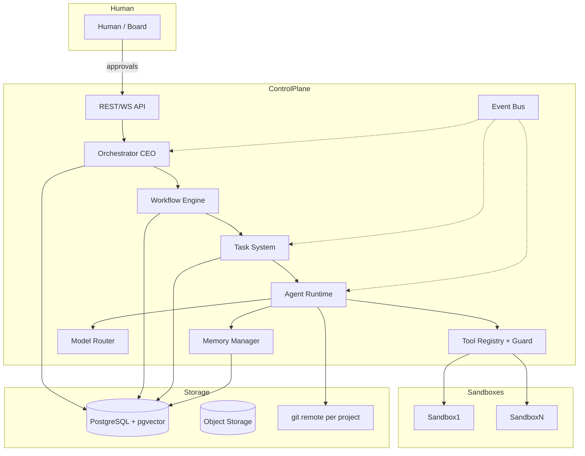

# 03 — SYSTEM ARCHITECTURE

---

## 1. Architecture Style

The system uses **modular monolith** architecture initially, with clean module boundaries so
individual services can be extracted later. Rationale:

- MVP does not need distributed complexity.
- Single deployable process with worker processes.
- All modules communicate through in-process interfaces or the event bus.
- Each module owns its data access via repository interfaces.

```
┌────────────────────────────────────────────────────────────────────────────┐
│                        CONTROL PLANE (Python process)                       │
│                                                                            │
│  ┌────────────┐  ┌────────────┐  ┌────────────┐  ┌───────────────────────┐ │
│  │  API / UI  │  │ Orchestrator│  │Workflow Eng│  │   Agent Runtime       │ │
│  │  (REST/WS) │  │   (CEO)     │  │            │  │  spawn/retrieve/etc   │ │
│  └────────────┘  └────────────┘  └────────────┘  └───────────────────────┘ │
│  ┌────────────┐  ┌────────────┐  ┌────────────┐  ┌───────────────────────┐ │
│  │ Task System│  │  Memory    │  │  Model     │  │   Tool Registry +      │ │
│  │            │  │  Manager   │  │  Router    │  │   Permission Guard     │ │
│  └────────────┘  └────────────┘  └────────────┘  └───────────────────────┘ │
│  ┌────────────────────────────────────────────────────────────────────────┐ │
│  │                       Event Bus (in-process -> PG pub/sub later)       │ │
│  └────────────────────────────────────────────────────────────────────────┘ │
└────────────────────────────────────────────────────────────────────────────┘
        │                    │                        │
        ▼                    ▼                        ▼
┌──────────────┐   ┌──────────────────┐      ┌──────────────────────┐
│ PostgreSQL   │   │  Object Storage  │      │  Sandbox Pool        │
│ + pgvector   │   │  (artifacts)     │      │  (Docker containers) │
└──────────────┘   └──────────────────┘      └──────────────────────┘
```

---

## 2. Module Breakdown

### 2.1 API / UI
- REST API (FastAPI) — command and query surface.
- WebSocket — streaming agent events.
- CLI — convenience wrapper over the API.
- Optional web dashboard (Phase 9+).

### 2.2 Orchestrator (CEO)
- Owns the *project pipeline*: IDEA → … → IMPROVEMENT.
- Decides the next stage, invokes managers, checks gate conditions.
- Process model: single orchestrator per project (no concurrency on stage transitions).

### 2.3 Workflow Engine
- Executes *workflow definitions* (declarative directed graphs of steps).
- Steps call *managers* or *agents*.
- Supports sequential/parallel/branch/retry/timeout/approval-gate human steps.
- Persists execution state in DB. See `07_WORKFLOW_ENGINE.md`.

### 2.4 Agent Runtime
- Loads agent definitions from config + prompts.
- Spawns model calls with injected context (system prompt + memory + tools).
- Handles streaming, token accounting, output validation.
- Implements agent retry loops. See `06_AGENT_LIFECYCLE.md`.

### 2.5 Task System
- Task state machine, prioritization queue, assignment, dependencies.
- Produces events on every transition. See `08_TASK_SYSTEM.md`.

### 2.6 Memory Manager
- CRUD for short-term/long-term/project/org memories.
- Vector indexing (pgvector) for semantic retrieval.
- Summarization and pruning. See `09_MEMORY_SYSTEM.md`.

### 2.7 Model Router
- Provider abstraction (OpenAI/Anthropic/Google/local).
- Model selection by task profile (complexity, cost, quality, latency, privacy).
- Fallback and cost tracking. See `12_MODEL_ROUTING.md`.

### 2.8 Tool Registry + Permission Guard
- Tool definitions (schema + allowed agents/permissions).
- Permission guard checks every tool call against the calling agent's policy.
- Sandbox admission control. See `11_TOOL_SYSTEM.md`, `36_AGENT_TOOL_PERMISSIONS.md`.

### 2.9 Event Bus
- Typed events (task_created, artifact_published, approval_required, …).
- In-process pub/sub; PGAbsCatalog of published events persisted for audit.
- Future: Redis/LPOP for scalability. See `16_EVENT_SYSTEM.md`.

---

## 3. Data Architecture

- **PostgreSQL 16 + pgvector** — source of truth for all non-code state.
- **Object storage** — (local MinIO dev; S3 in prod) for artifacts/binaries.
- **git** — source of truth for generated code; each project is a bare remote + working clone
  operated inside the sandbox.
- Entity model and schema: `28_DATABASE_DESIGN.md`.

---

## 4. Execution Architecture

- **Agent Workers**: homogeneous worker processes that pull tasks and run agents.
  Scale horizontally (N workers per org in v2+).
- **Sandbox**: Docker containers per execution context. See `19_SANDBOXING.md`.
- **Secret Store**: vault-backed or encrypted-at-rest store with injection into
  sandbox environment only as allowed by policy.

---

## 5. Deployment Topology (MVP)

```
┌────────────── host machine ──────────────┐
│ docker-compose                            │
│  ├─ control-plane (API + workers)        │
│  ├─ postgres (+ pgvector)                │
│  ├─ redis (bus/cache, optional in MVP)   │
│  └─ sandbox (docker socket/proxy)        │
└───────────────────────────────────────────┘
```

---

## 6. Component Interaction Rules

1. Agents **never** talk directly to each other across network boundaries.
2. All agent communication is mediated by: orchestrator, task system, event bus, project
   state, or artifact system.
3. Components read/write the DB only via their repository module.
4. The permission guard is the only entry point for tools.
5. The orchestrator is the only component that advances project stage.
6. All state mutations are logged to the event/audit store.

---

## 7. Mermaid: System Overview

