# 04 — AGENT ARCHITECTURE

---

## 1. Agent Definition Model

Each agent is defined declaratively (YAML) with a strict contract. Agents are **stateless
workers** — they do not own memory; the memory manager injects and persists memory around
each run. This makes agents cheap to retry and scale.

### Agent Definition Schema (conceptual)

```yaml
agent_id: backend_developer
department: development
name: Backend Developer
objective: "Implement backend features from assigned tasks"
model_profile: default_coding
max_tools: 8
spawn: false            # only the orchestrator spawns agents (MVP)
permissions:
  tools: [read_file, write_file, run_terminal, git_commit, run_tests, read_repo]
  resources:
    repos: [project_workspace]
    sandbox: workspaces/default
    network: none        # no egress for coding agents by default
  secrets: []            # no secret access
memory:
  inject: [project_memory, task_memory]
  write: [task_memory]
approvals:
  required: none
  optional: none
escalation:
  on: [low_confidence, blocked, policy_violation]
  to: orchestrator
review:
  reviewer_applies: true
artifacts: [code_changes, test_reports]
```

Full permission matrix in `36_AGENT_TOOL_PERMISSIONS.md`.

---

## 2. Agent Runtime Contract

An **Agent Run** is:

```
TaskInput(s) + Injected Context  --model-->  ModelOutput  --validate-->  RunResult
```

- **TaskInput**: the task payload (instructions, inputs, artifact pointers).
- **Injected Context**: system prompt, role rules, memory, tool schemas, constraints.
- **ModelOutput**: structured result from the model (text and/or tool calls).
- **RunResult**: validated outputs, artifacts produced, tool calls made, token usage,
  metatasks (e.g., "ask clarifying question", "create subtask").

Validation gates after each run:
- Output schema valid? (structured fields present)
- Required artifacts produced? (file path exists?)
- All required tool calls completed?
- Token budget respected?
- No policy violations?

---

## 3. Agent Hierarchy & Delegation Model

### Hierarchy

```
Orchestrator (CEO)  [root, depth 0]
├── PM Agent                  depth 1
│   └── (may NOT spawn children)
├── Research agents            depth 1
├── Architecture agents        depth 1
├── Developer agents           depth 1
│   └── Integration/frontend   depth 2 (via developer only within dev workflows)
└── QA/review/security agents  depth 1
```

### Rules

| Rule | Value |
|---|---|
| Who creates tasks? | Orchestrator, PM, and Task Planner only |
| Who assigns tasks? | Task System (on behalf of orchestrator/PM) |
| Who supervises agents? | Orchestrator supervises department leads; PM supervises product tasks |
| Who reviews outputs? | Reviewer agents + Quality dept + orchestrator gate |
| Who resolves conflicts? | Decision/Approval Agent (mediation); orchestrator for architecture |
| Who approves architecture? | Orchestrator → Board (human) at autonomy < L4 |
| Who approves production deployment? | Board (human) — always, regardless of level |
| Who handles failed agents? | Agent Runtime retries; orchestrator escalates after N failures |
| Who decides task completion? | Reviewer + orchestrator (state → COMPLETED) |
| Who can spawn sub-agents? | Orchestrator only (depth rules above) |
| Max agent depth | 3 |
| Max concurrent agents per project | configurable, default 4 |

---

## 4. Communication Model (Least Privilege)

Agents do **not** discover or message each other. Communication is mediated:

| Channel | Used for | Controlled by |
|---|---|---|
| Task payload | Work handed to an agent | Task System |
| Events | Notifications (artifact ready, approval needed) | Event Bus |
| Project State | Shared facts about the project | State Store |
| Artifacts | Shares produced documents/code | Artifact System |
| Orchestrator | A-collect, escalation, decisions | Orchestrator |

**A-direct** (peer messaging) is **not allowed by default** in the MVP. A governed `announce()`
mechanism may be added in v2 for supervised cross-agent Q&A via the orchestrator.

---

## 5. Agent Capability Matrix

| Capability | Product | Research | Architecture | Development | Quality | DevOps |
|---|---|---|---|---|---|---|
| Read project state | R | R | R | R | R | R |
| Read artifacts | R | R | R | R | R | R |
| Write artifacts | W | W | W | W | W | W |
| Read repo files | — | — | — | RW | R | R |
| Write repo files | — | — | — | W | — | — |
| Run terminal | — | — | — | W | R | W |
| Web search | — | W | — | — | — | — |
| Deploy | — | — | — | — | — | RW |
| Modify configs | — | — | — | RW | — | RW |

Full table: `36_AGENT_TOOL_PERMISSIONS.md`.

---

## 6. Diagonal / Lateral Communication (Governed)

When agent A needs info from agent B:
1. A emits an event `information_request`.
2. Orchestrator (or PM) evaluates: is the request safe and necessary?
3. Orchestrator reads from project state/artifacts OR spawns B's capability as a read-only
   tool for A, OR routes through an escalation.

This preserves auditability and least-privilege.

---

## 7. Agent Lifecycle Summary

See `06_AGENT_LIFECYCLE.md` for the full state machine. In brief:

```
CREATED → READY → CLAIMED → RUNNING → (VALIDATING →) SUCCEEDED
                              └→ FAILED → RETRY(delay/exponent) → RUNNING
                              └→ ESCALATED → orchestrator decision
                              └→ HUMAN_REVIEW_REQUIRED → RUNNING (after decision)
```

---

## 8. Concurrency & Isolation

- Each **project** runs its own set of agent workers; no cross-project interference.
- Each agent run gets a **dedicated context window**; memory injects are scoped.
- Two agents do not write the same file simultaneously: the file-lock/directory-lock policy
  in the workspace serializer (see `21`/`08`) guarantees serial writes per path prefix.
- Model calls are **idempotent by task id** (same inputs → no duplicate side effects).

---

## 9. Mermaid: Agent Hierarchy

```mermaid
flowchart TB
  B[Board: Human] --- CEO[Orchestrator CEO]
  CEO --> PM[PM Agent]
  CEO --> PDD[Product Dept]
  CEO --> RD[Research Dept]
  CEO --> AD[Architecture Dept]
  CEO --> DD[Dev Dept]
  CEO --> QD[Quality Dept]
  CEO --> OD[DevOps Dept]
  CEO --> MGMT[Management]
  PDD --> PM
  RD --> MR[Market Research]
  RD --> CR[Competitor Research]
  RD --> TR[Technical Research]
  AD --> SA[System Architect]
  AD --> DBA[Database Architect]
  AD --> SEA[Security Architect]
  AD --> DOA[DevOps Architect]
  DD --> BD[Backend Dev]
  DD --> FD[Frontend Dev]
  DD --> DB[Database Dev]
  DD --> API[API Dev]
  DD --> INT[Integration Dev]
  QD --> QA[QA Agent]
  QD --> TEST[Test Automation]
  QD --> CR2[Code Review]
  QD --> ST[Security Testing]
  QD --> PT[Performance Testing]
  OD --> CI[CI/CD]
  OD --> DEP[Deployment]
  OD --> INFRA[Infrastructure]
  OD --> MON[Monitoring]
  MGMT --> PROG[Progress Manager]
  MGMT --> DEC[Decision/Approval Agent]
```

