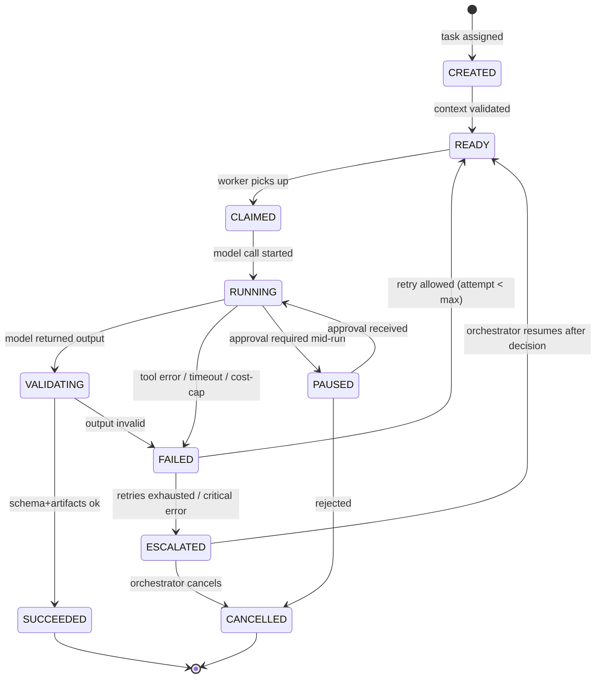
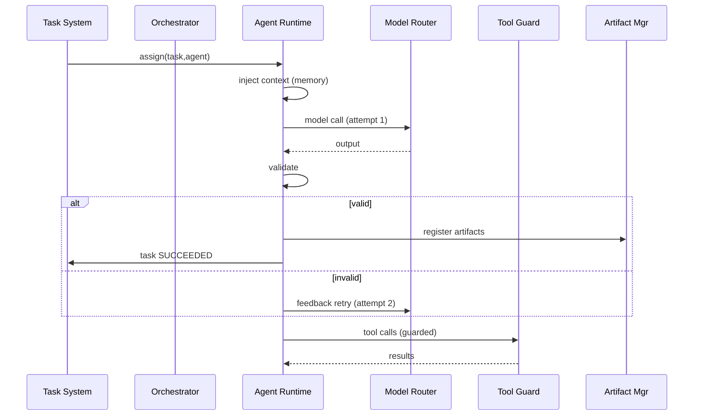

# 06 — AGENT LIFECYCLE

---

## 1. Agent Run State Machine

An *agent run* is one execution of one agent for one task.

---

## 2. States (Canonical)

| State | Meaning | Exit conditions |
|---|---|---|
| CREATED | Run record created for a task | context injection complete |
| READY | Awaiting a worker; queued | worker claims it |
| CLAIMED | Worker reserved run (lease) | lease acquired |
| RUNNING | Model/tool loop active | model returned; tool finished; timeout; error |
| VALIDATING | Output post-validation | passed → SUCCEEDED, else FAILED |
| PAUSED | Waiting on approval / external input | approval decision |
| SUCCEEDED | Output validated, artifacts recorded | — (terminal) |
| FAILED | Terminal for this attempt; may retry as new run | none (sibling RETRY runs created) |
| ESCALATED | Orchestrator/human decision needed | decision → new run or cancel |
| CANCELLED | Aborted | — (terminal) |

---

## 3. Attempt & Retry Policy

- Each *attempt* is a distinct `agent_run` row linked to the same `task`.
- Retry policy (configurable per agent, per project):
  - **max_attempts:** default 3 (coding agents 2).
  - **backoff:** exponential `base * 2^n` seconds, base=10s, cap=300s, jitter ±20%.
  - **transient errors** (network, model 5xx, provider rate-limit): retried automatically.
  - **deterministic errors** (invalid output after N=2 validation failures): do **not**
    auto-retry with same prompt; re-prompt with the validation feedback as a *new context*
    (this is a "feedback retry", not a raw retry).
  - **tool errors:** up to 2 retries with the tool error appended to context.
- **Feedback-based retries:** when the fixer loop (see `21_TESTING_SYSTEM.md`) routes a test
  failure back, it is a new task, not a run retry — so repeat attempts have escalating,
  informed prompts.

---

## 4. Spawning

- Only the orchestrator spawns agents. `spawn(agent_id, task_id, ctx)` creates a new
  `agent_run` in CREATED.
- Child runs inherit: sandbox, project id, permissions of the requested agent (never of the
  parent), memory scope.
- Depth is capped at 3; a spawn attempt beyond max depth is rejected with `ESCALATED`.
- Spawned runs are recorded with a `parent_run_id` link (trace).

---

## 5. Memory Injection & Persistence

At run start, the runtime asks the memory manager for:
- Agent system prompt (from definition) + role rules.
- **Project memory**: durable facts about the project (README-like distilled core).
- **Task memory**: history of the current task (prior attempts + review feedback).
- **Org memory**: relevant lessons/templates (retrieved by embedding similarity, cap k).
- **Context budget**: context is assembled within `context_budget_tokens` (e.g., 12k core +
  up to 60k task, configurable; see `12_MODEL_ROUTING.md`).

At run end:
- Successful outputs → write to task memory (distilled summary).
- Notable decisions → project memory (with source task id).
- Failures → write failure record (for retrospective).

---

## 6. Finalization & Artifacts

- After SUCCEEDED, artifact pointers produced by the run are registered with the artifact
  system (versioned), and the task transitions through REVIEW (see `08_TASK_SYSTEM.md`).
- The run emits events: `agent_run.started`, `agent_run.tool_call`, `agent_run.succeeded`,
  `agent_run.failed`, etc. (see `16_EVENT_SYSTEM.md`.)

---

## 7. Timeouts

| Scope | Default | Override |
|---|---|---|
| Model call | 300s | per-task |
| Tool call | 120s | per-tool |
| Total run (RUNNING) | 30min | per-agent |
| Whole task wall-clock | project-level | config |

On timeout: mark FAILED (reason=timeout), attempt retry per policy.

---

## 8. Mermaid: Run Lifecycle (state + events)

