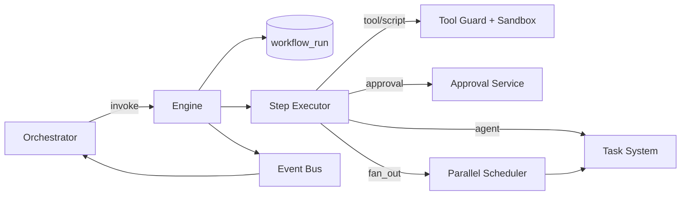

# 07 — WORKFLOW ENGINE

---

## 1. Purpose

The workflow engine executes **declaratively defined workflows** that model the business
process of building software. It is deliberately *not* a general BPM runtime (no Temporal/
Camunda dependency in MVP) — it is a purpose-built engine with a small, typed step set.

---

## 2. Workflow Definition

A workflow is a **directed acyclic graph (DAG)** of steps plus an entry point. Defined in
YAML:

```yaml
workflow_id: project_build
version: 1
entry: validate_idea
steps:
  - id: validate_idea
    type: stage_gate
    stage: VALIDATION
    next: research
  - id: research
    type: fan_out
    children: [market, competitor, tech]
    join: all
    next: validate_outcome
  - id: market
    type: agent
    agent: research_market
  - id: competitor
    type: agent
    agent: research_competitor
  - id: tech
    type: agent
    agent: research_technical
  - id: validate_outcome
    type: gate
    condition: research_complete and feasibility_ok
    on_false: approve_or_exit
  - id: approve_or_exit
    type: human_decision        # proceed / refine / abort
  - id: prd
    type: agent
    agent: pm_product_manager
    next: prd_approval
  - id: prd_approval
    type: human_approval
    required_levels: ["< L4"]
    on_reject: refine_prd
  - id: refine_prd
    type: agent
    agent: pm_product_manager
    next: prd_approval
  ...
  - id: dev
    type: fan_out
    children: [dev_backend, dev_frontend]
    join: all
  ...
  - id: deploy
    type: human_approval
    always_required: true
    then: run_deployment
```

### Step Types

| Type | Behavior |
|---|---|
| agent | Run one agent with a task (wraps Task System) |
| fan_out | Run children in parallel; join policy: all / any / count(n) |
| gate | Evaluate boolean condition on project state; route on_true / on_false |
| human_approval | Pause; wait for approval decision; on_reject routes to defined step |
| human_decision | Multiple-choice decision, e.g., proceed/refine/abort |
| script | Run a shell script in the sandbox (require explicit allow-list) |
| tool | Invoke a registered tool directly |
| emit | Raise an event (e.g., notify humans) |
| task | Create/queue one or more tasks explicitly |
| wait | Wait until condition (time-based or state-based) |

---

## 3. Execution Model

- A `workflow_run` instance records: workflow_id, project_id, current step stack, status,
  step results, timestamps.
- The engine executes step-by-step; each completed step persists results (immutable log).
- **Parallelism:** `fan_out` children are scheduled as separate `task`s; the engine waits on
  the join policy.
- **Failure within child:** child failure routes through retry policy; the join may be
  configured as `fail_fast` (cancel siblings) or `continue_on_error`.
- **Resumability:** a workflow_run can be paused and resumed; the engine resumes from the
  last completed step (idempotent; step results cached by `(run_id, step_id)`).

### Scheduling rules
1. Steps execute to a *step-result*; results are stored.
2. A child step never executes before its parent's join condition is satisfied.
3. Condition expressions evaluate against project state snapshot at execution time.
4. No micro-steps; a step is coarse (one agent run / one gate / one tool).

---

## 4. Retries, Timeouts, Rollbacks

### Retries
- Per-step `retry: {max: int, backoff: exp}`.
- Retry only marked `retryable` steps (agent, tool, script). Gates and human steps never
  auto-retry.
- The step-level retry is distinct from the agent-run retry (they compose: step retry spawns
  a fresh agent run when allowed).

### Timeouts
- Per-step `timeout`; per-fan_out overall budget.
- On timeout: step FAILED → retry or route to `on_timeout` branch.
- `wait` steps have absolute deadline.

### Rollbacks
- No automatic transactional rollback across the whole workflow. Instead:
  - Each mutating step records compensating instructions (`compensate` field referencing an
    undo step or manual note).
  - Deployment steps use health-check driven rollback (see `23_DEPLOYMENT.md`).
  - Code edits are isolated on task branches → discardable.

---

## 5. Human Approval Gates

- `human_approval` steps pause the run and emit `approval.required` event with the
  approval packet (who/what/impact/artifacts).
- Autonomy level (see `45_AUTONOMY_LEVELS.md`) determines which gates are **engaged**:
  - At L2+: gates with `required_levels: ["< L4"]` become active.
  - Gates marked `always_required: true` (e.g., production deploy) are **always** active.
- A pending approval may be skipped only by an explicit human decision `override`.
- Rejection routes via `on_reject` (typically a refine loop with escalation count cap).

---

## 6. Cancellation & Recovery

- Human (or policy watchdog) may cancel a workflow_run → children cancelled,
  `CANCELLED` recorded, compensating steps invoked if defined.
- Crash recovery: on restart, the engine scans `workflow_run` in RUNNING/PAUSED states.
  - RUNNING with no heartbeat > timeout → mark step failed and resume via retry policy.
  - PAUSED → re-emit approval event (idempotent by run+step) and stay paused.
- **Idempotency:** step results keyed by `(run_id, step_id)`; re-execution never double-counts.

---

## 7. Example Workflows

### 7.1 Project Build (top-level) — see `38_PROJECT_PIPELINE.md`

```
intake → research(fan_out) → validate → prd → [H]prd_approval →
architecture → [H]arch_approval → roadmap → task_generation →
development(fan_out/iter) → review → tests → security → [H]deploy_approval →
deployment → monitoring
```

### 7.2 Bug Fix Loop (driven by QA)

```
test_run_failed(H event) → bug_triage → bug_task(agent: dev) →
fix_pushed → test_re-run → reviews → merge_or_retry
```

### 7.3 Research-Only Workflow (for a user who wants research only)

```
intake → research(fan_out) → [H]deliverables_review (no code)
```

---

## 8. Concurrency Control

- One workflow run per project at stage level (stage transitions are serialized through the
  orchestrator).
- Multiple fan_out branches within a run run concurrently but write to *different* file
  areas by branch policy; conflict prevention via workspace serializer (see `08` §7, `21`).
- Engine itself uses optimistic row locking on `workflow_run` (version column) to prevent
  double advancement.

---

## 9. Mermaid: Engine Topology

