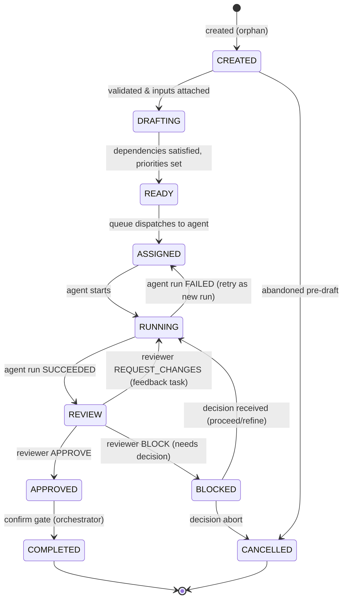
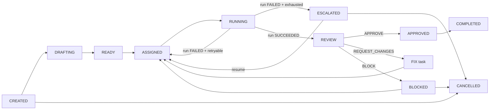

# 08 — TASK SYSTEM

---

## 1. Task Entity

A **task** is the unit of assignable work.

```yaml
task:
  id: uuid
  project_id: uuid
  type: research | document | code | review | test | security | deploy | fix | decision | admin
  title: str
  description: str
  priority: critical | high | medium | low
  status: (state machine, §3)
  parent_task_id: uuid|null
  subtask_ids: [uuid]
  dependencies: [uuid]            # tasks that must COMPLETED first
  depends_on_state: {artifact: id, version: n}   # optional
  assigned_agent_id: uuid|null    # which agent definition
  owner: uuid|null                # org member/user; null = system
  reviewer_agent_id: uuid|null
  inputs: [artifact_id]           # artifact pointers consumed
  expected_outputs: [artifact_id] # artifact pointers produced
  deadline: datetime|null
  estimate: {complexity: 1..13, effort_hours: float, confidence: 0..1}
  retry_count: int
  failure_reason: str|null
  approval: {required: bool, status: pending|approved|rejected|skipped, required_by: level}
  created_at, updated_at, started_at, completed_at: datetime
  tags: [str]
  cost: Money            # accrued from runs
```

---

## 2. Task State Machine



### Statuses

| Status | Meaning | Owner of next action |
|---|---|---|
| CREATED | Record exists; context being attached | Task System |
| DRAFTING | Validating inputs & dependencies | Task Planner |
| READY | Eligible for dispatch | Queue |
| ASSIGNED | Committed to an agent (queued for run) | Agent Runtime |
| RUNNING | An agent_run in progress | Agent Runtime |
| REVIEW | Output pending review | Reviewer agent |
| APPROVED | Review passed team quality | Task System |
| BLOCKED | Waiting decision (approval/conflict) | Orchestrator/Human |
| COMPLETED | Fully done & recorded | Task System |
| CANCELLED | No longer required | — |

---

## 3. Task Lifecycle Rules

1. A task is **READY** only when: all `dependencies` are COMPLETED, required inputs exist at
   specified versions, and it is not blocked by a policy hold.
2. **READY → ASSIGNED** is performed by the dispatcher (worker pool), choosing the assigned
   agent from `assigned_agent_id` (set at creation) or an agent resolver (task type
   → capability).
3. **RUNNING** is exclusive to one `agent_run` at a time (attempts are serialized).
4. **REVIEW** is entered only by the orchestrator confirming the run SUCCEEDED.
5. Change requests create a **subtask of type fix** linked to the original task (`parent=id`,
   `type=fix`) — keeps lineage and avoids mutating the original task's history.
6. Cancellation of a parent cascades to subtasks not yet COMPLETED.

---

## 4. Queue & Dispatch

- **Priority:** critical > high > medium > low; within priority: FIFO with aging boost
  (priority += age_days * 0.1 up to predefined cap).
- **Dispatcher** pulls READY tasks where `assigned_agent_id` has an idle worker and sandbox
  capacity.
- **Worker model:** each worker claims a task (`lease` with TTL), runs the agent, releases.
- Dead worker cleanup: lease expiry requeues the task (attempt count incremented).
- **Backpressure:** if sandbox pool saturated, dispatcher holds tasks (state remains READY).

---

## 5. Dependencies & Ordering

- Dependencies are a DAG (`task.dependencies`).
- Cycle detection is mandatory at creation time (reject cycle → error to planner).
- **State dependencies** can be declared on artifacts: `depends_on_state.artifact`
  requires a specific version of an artifact to exist before READY.
- Topological order enforced by `DRAFTING → READY` transition validation.

---

## 6. Estimates & Deadlines

- `estimate` set by the planner (PM or task generator), confidence 0..1.
- Progress Manager compares actual elapsed vs estimate; slippage > threshold triggers an
  `early_warning` event to PM (see `05`, `42`).

---

## 7. Conflict Prevention (File-Level Serialization)

- Coding tasks that target the same **workspace root** declare `write_scope` (e.g.,
  `backend/`, `frontend/`).
- A per-project **path lock** map prevents two RUNNING or REVIEW tasks with overlapping
  `write_scope` from editing concurrently; task is dispatched only when lock acquired.
- Overlap resolution: tasks are *rescheduled* or bundled serial when lock busy.
- Merge conflicts at the repo level are still possible only via branching; those are handled
  by the merge protocol in `21_CODE_REVIEW.md`.

---

## 8. Events Emitted by Task System

| Event | Payload |
|---|---|
| task.created | task id, type, priority |
| task.ready | task id, dependencies satisfied |
| task.assigned | task id, agent |
| task.started | task id, run id |
| task.run_failed | task id, attempt, reason (retryable?) |
| task.in_review | task id, run id |
| task.approved | task id, reviewer |
| task.changes_requested | task id, feedback id |
| task.blocked | task id, reason |
| task.completed | task id, artifacts |
| task.cancelled | task id, reason |

Consumers: orchestrator, workflow engine, observability, cost manager.

---

## 9. Mermaid: Full Task Lifecycle with Failure/Retry

