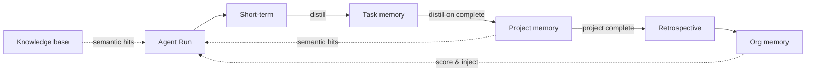

# 09 — MEMORY SYSTEM

---

## 1. Memory Layers

| Layer | Scope | Lifetime | Owner | Example contents |
|---|---|---|---|---|
| Agent short-term | one agent run | run ends → distilled | Agent Runtime | current tool outputs, scratch reasoning |
| Agent long-term | one agent over a project | project lifetime | Agent + Memory Mgr | agent's own past decisions/notes for this project |
| Task memory | one task lineage | task + subtasks | Task System | attempt history, fix feedback, reviewer notes |
| Project memory | one project | project lifetime | Orchestrator | decisions, facts, architecture choices, status |
| Organization memory | all projects | indefinite | Memory Manager | lessons learned, templates, best practices |
| Conversation memory | human ↔ system Q&A | configurable | API layer | chat history used for clarification |
| Knowledge base | curated corpus | indefinite | Knowledge System (10) | tech docs, standards, playbooks |
| Artifact memory | artifact metadata | artifact lifetime | Artifact System (14) | artifact pointers, versions, hashes |

---

## 2. Storage & Retrieval

### 2.1 Storage
- **Primary:** PostgreSQL. Each memory layer = table:
  `mem_project`, `mem_task`, `mem_org`, `mem_agent_longterm`, `mem_conversation`, `mem_episode`.
- **Vector index:** `pgvector` on `embedding` column for semantic search; embed on write.

### 2.2 Basic table model

```sql
CREATE TABLE mem_project (
  id uuid PK,
  project_id uuid FK,
  kind text,               -- decision | fact | note | lesson
  content text,
  embedding vector(1536) NULL,
  source_run_id uuid NULL,
  confidence float,
  created_at timestamptz,
  access_scope text;       -- agent ids or 'all'
);
```

- `mem_task`: keyed by task_id + attempt ordinal.
- `mem_org`: global; `kind` in (lesson, template, playbook, metric).
- `mem_episode`: raw run transcript summaries (short-term distilled into task memory).

### 2.3 Retrieval API
- `MemoryManager.get_structured(scope, filter)` — exact queries (by kind, project, agent).
- `MemoryManager.search_semantic(query, scope, k, metadata_filter)` — top-k vectors.
- `MemoryManager.inject_for_run(agent, task)` — composes the memory bundle injected into a run
  (project core summary + task history + scored org lessons, capped by token budget).

---

## 3. Indexing & Embeddings

- Embed using the configured embedding model (provider abstraction; see `12`). MVP: one
  embedding model shared by all layers; chunk size 512 tokens with overlap 64.
- Index metadata: source ids, timestamps, access scope, kind, tags.
- Hybrid retrieval: keyword + vector (PostgreSQL `tsvector` + `pgvector`), weighted.

---

## 4. Metadata & Access Control

- Every memory row has `access_scope`:
  - `project-all` (any agent of the project)
  - `agent:<agent_id>` (only that agent)
  - `org-all` (all projects)
  - `human-only`
- The memory manager filters rows at **query time** by the requesting agent's identity +
  department. Developers, for example, do not see competitor research that the product
  dept marked `human-only` or `product-only`.

---

## 5. Summarization & Cleanup

### Summarization triggers
- **Short-term → task:** after each run: `distill(run_events, max_tokens=2000)`.
- **Task → project:** after task COMPLETED: `distill(task_thread, max_tokens=800)`.
- **Project rollup:** every 25 completed tasks OR at stage transitions: create rolling
  project **core summary** (managed rolling window with truncation of old details).
- **Org learning:** after project COMPLETED → retrospective (see `22`, `38`) distilled into
  org memory.

### Cleanup
- Raw episode transcripts: retained 7 days, then reduced to the distilled form (audit keeps
  pointer only).
- Conversation memory: retention policy configurable (default 90 days).
- Org memory rows: never auto-deleted; archived after `archived_at` set by an operator.

---

## 6. Context Budget Composition

Order of injection into a run (by priority):
1. System prompt + task instructions (fixed).
2. Project core summary (top N tokens of most relevant facts).
3. Task history (attempts + feedback) — capped.
4. Semantic hits from project/org memory — ranked; fill remaining budget.
5. Tool schemas (compressed to used subset if budget exceeded).

Hard cap enforced; overflow spills to *read-only note file* in sandbox rather than prompt.

---

## 7. Mermaid: Memory Flow

