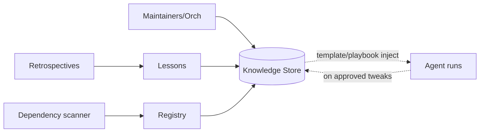

# 10 — KNOWLEDGE SYSTEM

---

## 1. Purpose

The knowledge system is the **curated, durable, reusable knowledge** of the organization —
distinct from memory (episodic). It provides:

- Project templates (README skeleton, PRD template, architecture template).
- Technology playbooks (e.g., how this org scaffolds a FastAPI service).
- Standards & conventions (commit message format, branch naming, test naming).
- Lessons learned (from retrospectives) as searchable entries.
- Allowed-dependency registry (pin-safe libraries + versions).

---

## 2. Knowledge Types

| Type | Source | Update cadence | Consumers |
|---|---|---|---|
| Template | maintainers / generated | on approved improvement | PM, architects, developers |
| Playbook | curated | on change | developers, DevOps |
| Standard/Convention | curated | on change | all agents |
| Lesson | retrospective | per project | all agents |
| Dependency registry | CVE scan + maintainer | continuous | security, developers |
| Decision log (ADR) | architecture dept | per decision | architecture |

---

## 3. Structure

```
knowledge/
  templates/        # project, prd, arch, deployment
  playbooks/        # scaffolding, testing, db-migrations, deployment-runbook
  standards/        # git, code-style, secrets, review-criteria
  lessons/          # one entry per learned lesson (with project & result)
  registry/         # allowed package registry (locked versions)
```

Stored as versioned artifacts + indexed rows (title, body, tags, embedding) in the
`knowledge` table.

---

## 4. Retrieval

- Semantic search over knowledge entries (vector) with scores; injection budget shares the
  same cap as memory (see `09` §6).
- Filter by `audience` (agent department/role).
- Templates are injected whole when a matching step runs (PRD step injects PRD template).

---

## 5. Governance

- Write access: restricted to orchestrator + maintainers (human) + designated special
  `knowledge_writer` tool used ONLY by the retrospective workflow.
- Every knowledge entry has: id, version, status (draft/active/archived), author, source
  project, date, and is immutable once `active` (new version edits only).
- Registration in the dependency registry requires a CVE audit pass.

---

## 6. Open Items

- Seed content for the first playbooks (MVP handbook in repo `docs/playbooks/`).
- Whether lessons auto-apply (e.g., "always pin dependency versions") — see `50`.

---

## 7. Mermaid: Knowledge Flow

