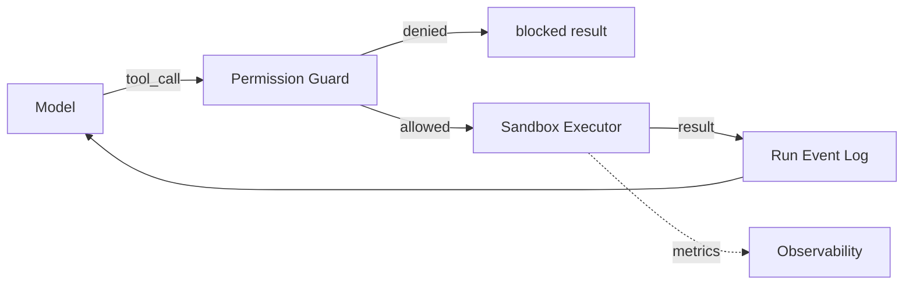

# 11 — TOOL SYSTEM

---

## 1. Tool Definition Contract

Every tool is registered in a **Tool Registry** with a strict contract:

```yaml
tool_id: read_file
name: Read File
description: Read text content of a file within a workspace.
input_schema:
  type: object
  properties:
    path: {type: string}
    line_limit: {type: integer}
  required: [path]
kind: fs           # fs | git | shell | web | db | exec | cloud | misc
sandbox: required  # runs inside sandbox fs/process environment
permissions:
  read: true
  write: false
  egress: none
audit: true
timeout_s: 30
retryable: true
auth: sandbox_user  # process-level identity
```

---

## 2. Canonical Tool Catalogue (MVP + future)

| Tool | Purpose | RW | Egress | Which agents |
|---|---|---|---|---|
| read_file | read workspace file | R | — | all |
| write_file | create/edit file | W | — | dev, docs, infra |
| list_dir / glob | filesystem discovery | R | — | all |
| run_terminal | execute shell command | exec | policy | dev, infra, qa |
| git_commit | stage+commit with message | W | git remote | dev |
| git_push | push to feature branch | W | git remote | dev, CI |
| git_status / diff | inspect working tree | R | — | all |
| PR / merge_request | open PR, request review | W | git remote | dev, CI/CD |
| web_search | search engine query | R | egress | research only |
| web_fetch | fetch URL content to text | R | egress | research only (allow-list) |
| exec_python | run python script in sandbox | exec | none default | qa, dev |
| run_tests | run project test suite | exec | none | qa, dev |
| docker_run | start services in sandbox pool | exec | policy | devops, dev(int) |
| db_query_migration | run migrations / read schema | RW | — | db architect, db dev |
| sast_scan | run static analyzer | R | — | security agent |
| dependency_audit | CVE scan on lockfile | R | egress(registry) | security agent |
| secret_scan | scan repo for secrets | R | — | security agent |
| deploy_target | deploy to configured env | W | egress | devops_deploy |
| health_check | probe deployed service | R | egress(local) | monitoring, devops |
| monitor_query | read deployed app metrics | R | egress | monitoring |
| knowledge_write | write lesson/template | W | — | orchestrator/retrospective |
| approval_request | create approval packet | W | — | orchestrator only |
| send_message | emit event / notify human | W | — | orchestrator + managers |

---

## 3. Permission Guard

- Every tool call passes through the **Permission Guard**, which validates:
  1. Agent definition allows tool (agent.tools).
  2. Tool-level permission satisfied by agent's department (RW + scope).
  3. Path/target is within agent's permitted roots.
  4. Egress rules satisfied (dest allow-list).
  5. Sandbox policy allows (network/fs limits).
- Denied calls: recorded as `tool_denied` event, returned to model as a *blocked* result
  (the model may adapt or escalate; repeated policy warnings trigger FAILED).
- Override requires explicit human `allow_once` scoped to a single run.

---

## 4. Tool Call Lifecycle

```
Model emits tool_call → Guard.validate(tool, agent, args)
   → Sandbox.execute(tool, args, limits)
   → Result(type: ok|error|blocked|timeout, payload, usage)
   → recorded in run event log → injected back to model
```

---

## 5. Security Risks by Tool (summary)

| Tool | Main risks | Controls |
|---|---|---|
| run_terminal | arbitrary code, exfiltration, destructive ops | allow-list command prefixes per role? No — full read-only default, escalation; sandbox no network; command auditor; deny explicit blocked commands (rm -rf /, etc.) |
| web_fetch | SSRF, phishing data | URL allow-list/deny-list; DNS rebinding guard; timeout; egress proxy (MVP: none for dev agents) |
| web_search | prompt-injection via content | research agents treat retrieved text as untrusted data, quoted, never as instructions; source annotation forced |
| git_push | credential leak, force-push | sandbox git identity limited; no credential material; protected branches |
| deploy_target | unauthorized prod change | always human-approved gate; env-scoped credentials; audit |
| exec_python | resource abuse | CPU/mem/time limits in sandbox |
| dependency_audit | supply chain | registry allow-list, checksum pinning, scoped network |

---

## 6. Tool Versioning & Rollout

- Tools define `version`; schema changes require registry migration + re-listing in agent
  definitions.
- New tools are added behind a feature flag and are opt-in per agent definition.

---

## 7. Mermaid: Tool Call Path

