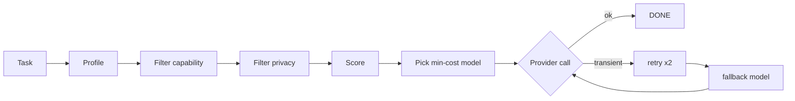

# 12 — MODEL ROUTING

---

## 1. Provider Abstraction

Purpose: no code path hardcodes a provider. A `ModelClient` interface is implemented per
provider:

```
interface ModelClient:
  chat(messages, tools, params) -> ModelResponse
  embed(text) -> vector
  stream(messages, ...) -> AsyncIterator[TokenDelta]
```

- Providers: `openai`, `anthropic`, `google`, `ollama` (local), `vllm` (local, optional).
- A provider may not be available; routing must degrade gracefully to configured fallbacks.

---

## 2. Model Registry

```yaml
models:
  - id: gpt-4o-mini
    provider: openai
    capability: {level: fast, tool_calls: true, context: 128k}
    cost: {in: 0.15e-6, out: 0.6e-6}    # per token USD
    latency: {p50_ms: 500}
    quality: {rank: 3/5}
    enabled: true
  - id: claude-sonnet
    provider: anthropic
    capability: {level: strong, tool_calls: true, context: 200k}
    cost: {in: 3e-6, out: 15e-6}
    ...
  - id: local-qwen-32b
    provider: ollama
    capability: {level: medium, tool_calls: false, context: 32k}
    cost: {fixed_per_1k: 0}
    hardware: cpu_or_gpu
```

---

## 3. Task Profiles

Each task type declares a routing profile:

| Profile | Example tasks | Selection priority |
|---|---|---|
| cheap_default | classification, summarization of small text | low cost + adequate quality |
| research | web research, long reads, citations | large context, high recall |
| coding | implement feature, fix bug | tool_calls + high quality |
| review | code review, security analysis | high reasoning quality |
| architect | architecture, PRD, ADR | highest reasoning (expensive allowed) |
| internal | memory distillation, meta tasks | cheap |

Model ↔ profile mapping is stored in `model_assignment` table with weights + fallback chain.

---

## 4. Router Decision

At run creation, the runtime asks the router for a model:

```
select model:
  - filter by required capabilities (tool_calls, context_size >= task.context_needed)
  - filter by enabled + provider_available
  - filter by privacy (project.private => local-only or data-residency-approved)
  - score = w_cost*cost_norm + w_lat*latency_norm + w_qual*quality_norm + w_avail*availability
  - pick min score; fallback chain of next 2 if provider fails mid-call
```

- **Context size:** estimated from injected context; model with context < required is
  excluded (or context is truncated and flagged).
- **Cost caps:** if projected cost exceeds task budget, router downgrades profile or blocks
  with `ESCALATED` (cost controller; see `26`).

---

## 5. Fallback & Degradation

- If provider call fails (timeout/5xx/rate-limit):
  1. Retry same provider ×2 with backoff (transient).
  2. Next model in fallback chain with `= or better` capability.
  3. If all fail → RUN FAILED (reason=model_unavailable), escalate.
- If output quality gate fails (see `06` §3): retry same model once with feedback; then try
  a higher-quality model in the same profile; then FAILED.

---

## 6. Embeddings

- One embedding model per environment. MVP default: **local sentence-transformers**
  (`all-MiniLM-L6-v2`) — zero cost, no API keys, privacy-friendly; cloud embeddings
  (e.g., `text-embedding-3-small`) configurable as an alternative (see `50`, Q7).
- Embedding version is stored with every vector (`emb_version`) to force re-embed on model
  change.

---

## 7. Observability Integration

Every model call logs: task_id, run_id, profile, model, provider, tokens(in/out), cost,
latency, retries, fallback used. Consumed by `26_cost_control` and `27_observability` and
used offline to tune `model_assignment` weights.

---

## 8. Open Questions

- Default provider at deployment time for each environment? (see `50`).
- Whether to support streaming to humans for live transcript viewers in v0.

---

## 9. Mermaid: Routing

