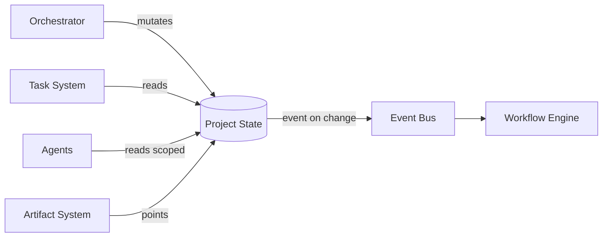

# 13 — PROJECT STATE

---

## 1. Purpose

The project state store is the **single source of truth** for all non-code project data.
Every agent reads state; the orchestrator and task system mutate the master copy; derived
views are read-only.

---

## 2. State Model

```yaml
project:
  id, name, description
  stage: IDEA → INTAKE → RESEARCH → VALIDATION → PRD → ARCHITECTURE → ROADMAP →
         TASK_GENERATION → DEVELOPMENT → QA→ SECURITY → DEPLOYMENT → MONITORING →
         MAINTENANCE → IMPROVEMENT
  autonomy_level: 0..5
  status: active | paused | blocked | completed | cancelled
  owners: [human user id]
  config: { budgets, retryPolicy, approvals, providers }
  decisions: [decision records]        # ADR-like log
  facts: [key facts with confidence]   # distilled project memory core
  current_workflow: workflow_run_id
```

Also tracked as part of project state:
- **pipeline progress**: stage entry/exit times, current gate.
- **open issues/risks**: risk register (list of (risk, probability, impact, mitigation)).
- **metrics**: token usage, cost, task throughput (aggregated from runs).

---

## 3. Invariants

1. Project `stage` transitions only via the orchestrator (single writer).
2. State writes are append-only logs for decisions; mutable fields (stage, status) use row
   versioning to prevent lost updates.
3. State read cache (in-process) is only a cache; always refreshed from DB.
4. Every field change emits `project.updated` event with old/new value (audit).

---

## 4. Access

| Role | Read | Write |
|---|---|---|
| Orchestrator | all | stage, decisions, facts |
| PM | all | plans, roadmap fields |
| Agents | their scope (dept-limited) | defined fields only |
| Human | all | via approval UI → orchestrator |

Dept-scoped filters: `facts` can carry `scope` field (e.g. `market` facts only visible to
research/product depts).

---

## 5. Snapshot & Restore

- Snapshot of full project state at each stage transition (`project_state_snapshot` table +
  artifact in object storage, JSON).
- Restore = revert stage + restore snapshot; used by rollbacks and after system migration.
- Kept for audit; retention configurable (default: all snapshots).

---

## 6. Mermaid: State Ownership

