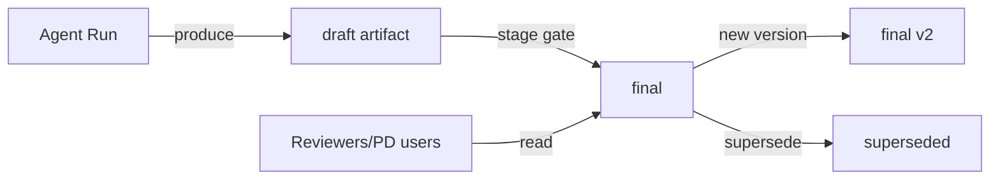

# 14 — ARTIFACT SYSTEM

---

## 1. Purpose

Artifacts are the **versioned deliverables** produced by agents and workflows — documents
(PRD, architecture, tests), code changes (diffs/commits), build outputs, test reports, and
deployment records.

---

## 2. Artifact Model

```yaml
artifact:
  id: uuid
  project_id: uuid
  name: prd.md
  kind: document | code_patch | build | test_report | deploy_record | diagram | decision
  version: int            # monotonic per artifact
  uri: s3://.../svc/12    # or object-storage key
  hash: sha256
  producer: {agent_id, run_id, task_id}
  status: draft | final | superseded | archived
  meta: {tags, stage, mime, size}
  derived_from: [artifact_id]     # provenance (e.g., test report from code patch v3)
  approvals: [approval id]        # approvals attached
  created_at, updated_at
```

---

## 3. Operations

- **create**: agent run finalizes → artifact registered (must be committed to object store
  first).
- **read**: by artifact id+version; agents receive `uri` + hash, not raw contents (contents
  pulled through sandbox read).
- **update**: new version (never overwrite).
- **finalize**: draft → final (by policy: stage gate or reviewer).
- **supersede**: explicit mark, e.g., PRD v2 supersedes v1.

---

## 4. Provenance & Lineage

- Each artifact records producer + derived_from. Full dependency graph enables:
  - "which code versions satisfy PRD v3?"
  - "which test reports cover backend v5?"
- Provenance is used for rollback decisions and audit.

---

## 5. Storage

- **Metadata**: PostgreSQL `artifact` table.
- **Blobs**: object storage (MVP: MinIO local; prod: S3-compatible). Local filesystem backed
  by same abstraction in dev.
- **Code artifacts**: tracked in git (commits) — artifact system stores commit hashes;
  PRs/diffs are artifacts of type code_patch linking task → commit.

---

## 6. Access Control

- Artifacts inherit project scope; additional `access_scope` (same model as memory) can
  restrict (e.g., security findings are `security-only` until triaged).
- Downloads require agent identity matching scope.

---

## 7. Retention

| Kind | Retention |
|---|---|
| documents | whole project lifetime |
| code_patch | git history (forever), artifact row lifetime |
| test_report | 1 year |
| deploy_record | whole project lifetime |
| snapshots | projector lifetime |

---

## 8. Mermaid: Artifact Lifecycle

