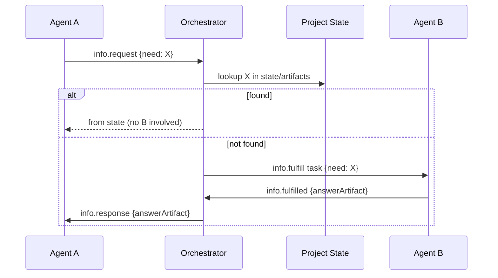

# 15 — COMMUNICATION PROTOCOL

---

## 1. Principle

Agents **do not directly message each other.** All communication flows through the four
governed channels:

1. **Task System** — "work" flows (assignments, results, reviews).
2. **Event Bus** — "notifications/state changes" (fire-and-forget facts).
3. **Project State** — "ground truth" (shared facts, decisions).
4. **Artifact System** — "produced content" (documents, patches, reports).

Plus the **Orchestrator** as the sole routing authority for anything beyond these channels
(e.g., conflicts, information requests, escalations).

---

## 2. Message Types (unified envelope)

Every inter-component communication uses a typed envelope via the event bus:

```yaml
event:
  id: uuid
  type: artifact.published | task.completed | approval.required | info_request | ...
  project_id
  emitted_by: {agent_id, run_id, task_id}
  payload: {...}
  timestamp
  trace_id, span_id
```

---

## 3. Information Request Protocol (cross-agent Q&A)

Since agents don't peer-message, if agent A needs info from agent B:

1. A emits `info.request` (payload: need, context, my artifacts).
2. The **orchestrator** evaluates: 
   - Is the answer already in project state/artifacts? → orchestrator answers from state.
   - Is it safe to grant read access to the target artifact? → grant point-in-time read token.
   - Otherwise → queue an `info.fulfill` task assigned to B (B produces a small artifact).
   - If B doesn't know → escalate to PM/human with the question.
3. Responses recorded with trace link (A.request → B.fulfill → A.receive).

---

## 4. Who May Send What

| From → To | Sender rules |
|---|---|
| Orchestrator → any agent | flows: assign task, approve, cancel, inject info |
| Agent → Orchestrator | results, escalations, info.requests, risk notes |
| Agent → Task System | emits run results (SUCCEEDED/FAILED), review feedback |
| Agent → Artifact System | publishes artifacts |
| Agent → Event Bus | publishes typed facts (scoped to project) |
| Agent → Agent | NOT allowed (blocked by infrastructure) |
| Human → System | commands via API/CLI/UI |
| System → Human | approval packets, notifications, reports |

---

## 5. Framing & Trust

- Every message carries `trace_id` for a full causal chain.
- Receiver validates: sender identity + role, message type allowed for sender's dept, and
  payload schema.
- Unknown/mismatched types are dropped and logged as `comm.violation` (escalation triggers
  if repeated).
- No sender may spoof another agent_id (run-scoped token binds identity).

---

## 6. Synchronous vs Async

| Need | Mechanism |
|---|---|
| Agent needs tool result | sync (tool call chain) |
| Run state to orchestrator | async event (idempotent) |
| Human decision wait | async (PAUSED workflow) |
| Cross-agent info | async via orchestrator |
| CLI/API commands | sync request/response |

---

## 7. Sequence: Cross-Agent Info Request

