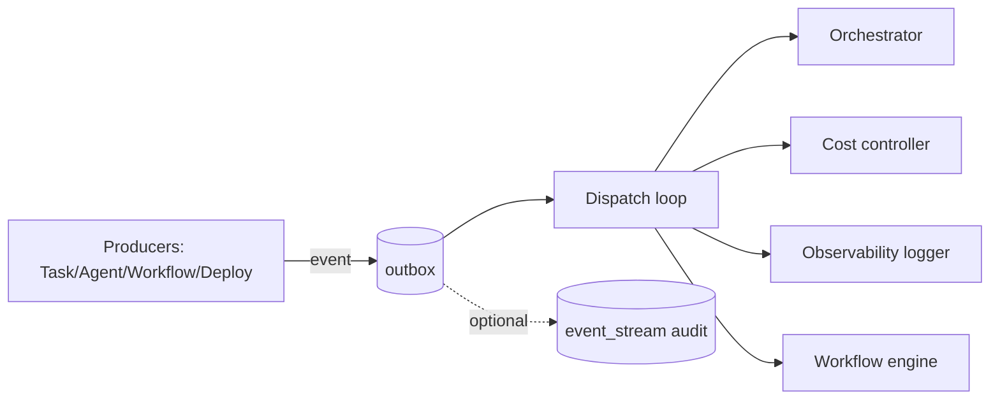

# 16 — EVENT SYSTEM

---

## 1. Purpose

The event bus decouples producers from consumers. Events are the primary way components
react to state changes without direct coupling.

---

## 2. Event Taxonomy (namespace.topic)

**Domain events**
- `project.created`, `project.stage_changed`, `project.snapshot`
- `task.created|ready|assigned|started|run_failed|in_review|approved|changes_requested|blocked|completed|cancelled`
- `agent_run.started|tool_call|succeeded|failed|escalated`
- `artifact.published|finalized|superseded`
- `workflow.step_started|step_completed|paused|resumed|completed|failed|cancelled`
- `approval.required|approved|rejected|overridden`
- `memory.injected|distilled`
- `deployment.started|succeeded|failed|rolled_back`
- `test.run_started|run_completed|failed`
- `incident.raised|acknowledged|resolved`
- `cost.budget_warning|budget_exceeded`
- `security.finding|policy_violation`

**System events**
- `comm.violation`, `model.provider_failed`, `sandbox.oom`, `worker.heartbeat_lost`

---

## 3. Delivery Model

- **In-process MVP:** async pub/sub with in-memory queues (workers are threads/processes of
  the control plane).
- **Outbox:** every domain event is persisted to `event_outbox` (same DB transaction as the
  mutation) → guaranteed at-least-once delivery to subscribers; processed by a dispatcher.
- **Idempotent handlers:** consumers dedupe by event id.
- **Scoped subscription:** subscribers declare `match: project_id? | event_type prefix?`.
- Future: Redis Streams / NATS adapter behind the same interface.

---

## 4. Subscription Rules

- Agents do **not** subscribe to arbitrary events at runtime (avoid surprise activation).
- Managed subscriptions:
  - Orchestrator: stage-relevant events (task completed, approval needed, escalation).
  - Task System: agent_run events → task state transitions.
  - Workflow Engine: gate/approval events → resume workflows.
  - Cost controller: model/token events → budgets.
  - Observability: everything (persisted log).
- Any unmanaged agent-facing subscription requires explicit definition in agent config
  (by default: none).

---

## 5. Persistence & Replay

- `event_stream` table (never deleted; retention configurable, default keep-always for
  audit).
- Replay endpoints for observability and workflow recovery (re-derive current state by
  replaying task events bounded by snapshot).

---

## 6. Ordering

- Within a single aggregate (e.g., one task, one workflow_run): ordered by `seq` within a
  per-aggregate sequence.
- Cross-aggregate ordering is not guaranteed (events carry causal `prev_event_id` for
  tracing only).
- Compaction: for observability replay, event log can be compacted to latest snapshot +
  delta (retention optional).

---

## 7. Security

- Events can carry sensitivity: `access_scope` field (default: project_all). Security
  findings events are `security-only`.
- No secrets ever in event payloads (pointers only).

---

## 8. Mermaid: Event Flow

