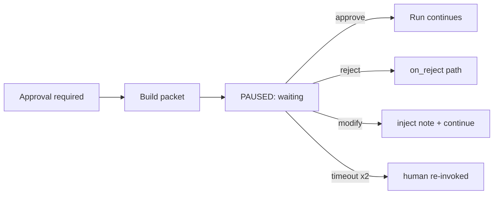

# 17 — HUMAN APPROVAL

---

## 1. Model

Approvals are **risk-tiered and level-dependent** (see `45_AUTONOMY_LEVELS.md`, `46_HUMAN_IN_THE_LOOP.md`):

```
Risk = f(impact, reversibility, target, spend)
```

| Tier | Examples | Default level where approval active |
|---|---|---|
| T0 – No approval | read-only research, drafting internal docs | always auto |
| T1 – Project-internal | code changes in feature branches, local test runs | auto; review-gated at L1 |
| T2 – Stage boundary | PRD finalize, architecture approval, security sign-off | < L4 |
| T3 – External/irreversible | production deploy, external spend, data export, credential changes | **always required** |

---

## 2. Approval Packet

When approval is required, a packet is created and the workflow pauses:

```yaml
approval:
  id, project_id, task_id/workflow_run_id
  title, description
  material: {artifacts: [], diffs: [], decision_docs: []}   # pointers
  requested_action: approve|reject|override|modify
  impact_summary: {what changes, reversibility, cost, risk, alternative}
  requester: {agent_id, run_id}
  deadline: datetime|null (default per level)
  reviewers: [human user id]
  status: pending|approved|rejected|overridden|cancelled
  decision: {user, comment, at_timestamp}
```

---

## 3. Approval UX

- Approval requests appear in the CLI/API (MVP) + dashboard (v1).
- Human can: 
  - **approve** (run continues)
  - **reject** (run routes via on_reject)
  - **override with modification** (inject a decision note attached to the artifact; e.g.,
    "change DB to Postgres")
  - **request changes** (loops back to producer with comment)
- All decisions recorded immutably in `approval` + audit log.

---

## 4. Autonomy-Level Gating

| Autonomy level | Active approval gates |
|---|---|
| L0 | all (human does everything) |
| L1 (recommend) | all gates engaged; system recommends, human executes |
| L2 (execute+approve) | T2 + T3 |
| L3 (auto most) | T3 only |
| L4 (managed) | T3 only; system may schedule deploy windows |
| L5 (board oversight) | T3 only + monthly review; long-approval fallback |

T3 gates are **never bypassed at any level**. A level override to auto-approve T3 requires an
admin setting change (not a runtime toggle).

---

## 5. Timeouts & Defaults

- Pending approval timeout default: 48h (configurable). On timeout → reminder; after ×2 →
  workflow stays PAUSED (never auto-proceeds). Escalation email/notification.
- `deadline` per approval; late decision → marked `expired`, human re-invoked with original
  material.

---

## 6. Approval Chain of Command

1. **Agent-level** decisions (low risk): review by reviewer agent → task APPROVED.
2. **Stage gates** (T2): orchestrator → human board (or auto at L4? no—still gate above).
3. **T3**: human board always.
4. **Conflicts** (agents disagree): Decision/Approval agent prepares mediation packet → human
   decision if T2+.

---

## 7. Audit of Approvals

- `approval` table rows are append-only; decisions carry human id + timestamp.
- Approval materials are snapshotted (artifact versions pinned) so reviews are reproducible.

---

## 8. Mermaid: Approval Flow

