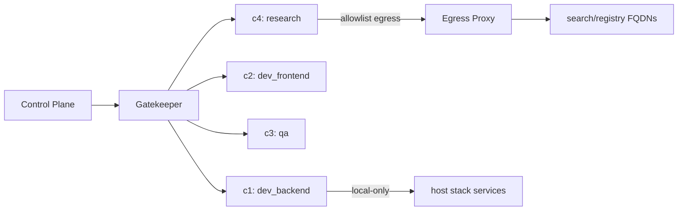

# 19 — SANDBOXING

---

## 1. Purpose

Each agent run that touches code, shell, or the network executes inside an **isolated
container**. The sandbox provides the security boundary that lets development agents be
powerful without being dangerous.

---

## 2. Isolation Model

- **Container per execution context** (per project + per write-scope, pooled for reuse).
- MVP tooling: `docker` (rootless where possible); v1: single container with OCI security
  profile + seccomp; alternative Kubernetes sandbox (gVisor/Firecracker) is future work.
- The control plane runs on the host; the container is reachable only through the sandbox
  gatekeeper (gRPC or REST tool exec).

```
Control Plane ── sandbox gatekeeper ──► container { fs-roots, limits, network policy }
```

---

## 3. Resource Limits (defaults)

| Resource | Default | Enforced by |
|---|---|---|
| CPU | 1.0 vCPU | docker `--cpus` |
| Memory | 1 GiB (dev), 2 GiB (qa/build) | `--memory` |
| PIDs | 256 | `--pids-limit` |
| Wall-clock per command | 120s | gatekeeper |
| Wall-clock per run    | 30 min | gatekeeper + runner |
| Disk (workspace)      | 5 GiB | volume quota |
| Open files / processes | default cgroup + rlimit | seccomp/rlimit |
| Network | default none | network namespace policy |

---

## 4. Network Policy

| Mode | Allowed | Used by |
|---|---|---|
| `isolated` (default) | none | dev, qa, deploy-inspectors |
| `allowlist` | dest-based allow-list via egress proxy | research (web api), package registry hosts |
| `local-only` | host network for stack services (localhost) | integration, e2e tests, local deploy |

- DNS filtering + egress proxy applies at container network namespace; only TCP 443/80 to
  allowed FQDNs; UDP DNS limited.
- Loopback is enabled within the container/mesh for inter-service tests.

---

## 5. Filesystem Policy

- Mounts:
  - `<project>/workspace` → `/workspace` (rw) for dev agents.
  - `<global>/cache` → `/cache` (rw, sandbox-shared package cache).
  - system dirs read-only.
- No host mounts outside project paths; no Docker socket inside sandbox (except
  `docker_ctl` tool restricted to devops agents with allow-list args).
- Write-scope lock in Task System (08 §7) guarantees no concurrent writes to overlapping
  roots.

---

## 6. Process & Command Policy

- A command **auditor** blocks dangerous patterns before dispatch:
  deny-list prefixes: `rm -rf /`, `mkfs`, `shutdown`, `reboot`, `chmod -R 777 /`, curl|sh,
  wget|bash, `sudo ···` (no sudo inside sandbox), `:` weird, etc.
- No privileged process (non-root user), dropped capabilities (`cap_drop: ALL`),
  `no-new-privileges`.
- Time limit per command kills the process tree.

---

## 7. Secret Injection

- Secrets reach sandbox only through explicit `secret_allow` on the task; injected as
  environment variables with ephemeral lifetime, deleted on run end.
- A mounted `env-vault` file removed immediately after read (`unlink`).
- Never echoed in logs; tool outputs redact secret-shaped values.

---

## 8. Lifecycle & Cleanup

- Warm pool: N containers (configurable; MVP default 4) reused across runs of the same
  project + scope; cold start ~300ms warm / ~2s cold.
- On run end: workspace deltas are committed (diff to git) *before* container teardown;
  temp files in sandbox discarded.
- Container GC: idle > 1h → removed; images pruned weekly; logs shipped to observability.

---

## 9. Logging

- Container stdout/stderr → per-project run logs (structured, redacted).
- Command invocation + duration + exit code traced with the run.
- Access to container shell/UI is out of scope (no human SSH into agent sandboxes; humans
  use the repo).

---

## 10. Escape & Evac Introductions

- Defense-in-depth: seccomp + AppArmor profile; no `--privileged`.
- `docker inspect`/`exec` tools restricted; audit logs capture gatekeeper calls.
- If sandbox breach suspected (host pid visible, unexpected egress) → **kill container,
  revoke tokens, incident raised**, audit.

---

## 11. Mermaid: Sandbox Topology

