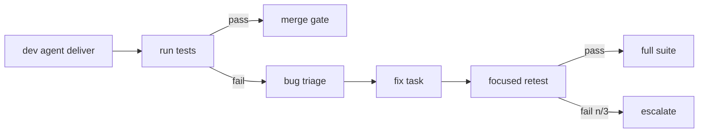

# 21 — TESTING SYSTEM

---

## 1. Testing Layers (target)

| Layer | Coverage | Tooling (MVP-friendly) | Run config |
|---|---|---|---|
| Unit | functions/components | pytest / vitest+Jest | `unit` filter |
| Integration | module boundaries, DB | pytest + testcontainers | `integration` filter |
| API | HTTP endpoints | pytest + httpx | `api` filter |
| E2E | user journeys | Playwright | `e2e` filter |
| UI | rendering/interaction | Playwright | `ui` filter |
| Security | SAST/Vuln/secret | bandit/semgrep + pip-audit | `security` |
| Performance | latency/throughput | locust / pytest-benchmark | `perf` |
| Regression | full suite on merge | combined | merge |

All filters are strings/paths resolved from the project's `testconfig.yaml`.

---

## 2. Who Writes Tests

- **Test Automation Agent** generates tests from acceptance criteria (part of dev task:
  code + tests delivered together as a code patch artifact).
- Unit tests authored with code (dev agent); integration/API/E2E authored by test agent
  where code tasks specify them.
- The **QA lead** maps coverage to requirements (traceability matrix) and flags gaps.

---

## 3. Test Run Pipeline (per merge/PR)

```
push to feature branch
 → commit-level static checks (format, lint, type, lock-check)
 → unit + integration (parallel where scopes allow)
 → api tests
 → e2e (staging compose)
 → security + dependency audit
 → perf smoke (if NFR flagged)
 → combined report artifact → merge gate (all pass or explicit waiver + human approval)
```

---

## 4. Failure → Debug Loop

Failed tests do **not** become raw re-prompts. Flow:

1. `test.run_failed` event with `TestFailure[]` captured.
2. **Bug triage** (QA lead + PM): severity, scope, possible root cause via failing stack
   traces (passed via artifact `test_report`).
3. Creates `fix` subtask → dev agent with *reasoned context*: failing test output + code
   pointer + hypothesis list.
4. Fix → rerun focused test set (fast subset) → then full affected suite.
5. Still failing after max fix loops (default 3) → escalate to PM/human with full test
   history.

### Fix-loop retry budget

| Attempt | Prompt upgrades |
|---|---|
| 1 | test failure + code context |
| 2 | + prior failed attempt diff (this is new context) |
| 3 | + senior review agent opinion / human hint |

---

## 5. Test Run Records

```yaml
test_run:
  id, project_id, task_id, commit_sha, image_digest
  filter, status: pending|running|passed|failed|error|skipped
  duration_ms
  tests: {total, passed, failed, skipped, errors}
  artifacts: [report_uri, logs_uri]
  created_at, completed_at
```

Metrics feed: `24_MONITORING`, `27_OBSERVABILITY`, and the traceability matrix.

---

## 6. Coverage Policy (MVP)

- **Threshold:** line coverage ≥ 70% on new code; branch ≥ 60%.
- Coverage measured on the diff (only new lines count) — avoids gaming by editing tests
  only.
- Below threshold → task flagged for review; waiver requires human override.

---

## 7. Mermaid: Test & Fix Loop

