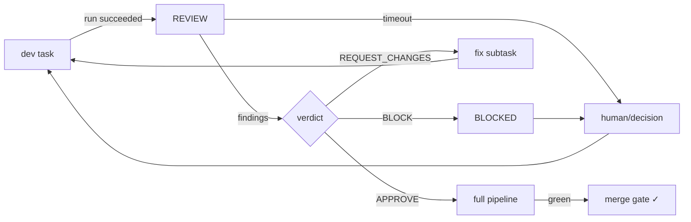

# 22 — CODE REVIEW

---

## 1. Review Workflow

Every code task that reaches `REVIEW` (task state machine) is reviewed by the **Code Review
Agent** (with security/perf reviewers invoked when findings suggest).

```
task RUNNING→SUCCEEDED → REVIEW
  → review packet {diff (from base branch), tests run/results, coverage, description}
  → reviewer agent produces: ReviewFinding[] + verdict (APPROVE|REQUEST_CHANGES|BLOCK)
  → verdict applies: 
       APPROVE → task APPROVED → merge gate runs full pipeline
       REQUEST_CHANGES → create fix subtask with findings
       BLOCK → task BLOCKED → orchestrator/human decision
```

---

## 2. Review Criteria (structured rubric)

| Dimension | Checks |
|---|---|
| Correctness | logic vs acceptance criteria, edge cases, error handling |
| Security | injection (SQL/XSS/path), secrets, authz missing, unsafe deserialization |
| Performance | N+1 queries, unbounded loops, hot-path allocations |
| Maintainability | naming, structure, duplication, complexity hints |
| Convention | matches org standards (git/style/test naming) |
| Test quality | tests cover the change; not vacuous; assertions meaningful |
| Dependencies | new deps allowed + audited (registry + CVE) |

---

## 3. ReviewFinding Contract

```yaml
finding:
  id, task_id, commit_sha, line_ref, file_ref
  severity: critical|high|medium|low|nit
  category: correctness|security|perf|style|test
  description, suggestion
  rule_id: optional link to org standard
```

- **Critical/High** findings → auto REQUEST_CHANGES.
- **Low/Nit** → recorded, non-blocking (bundle; may auto-fix in a `chore` task).
- Confidence field per finding (decision framework `44`).

---

## 4. Blocker Rules

- Any new **critical** security finding blocks merge until fixed.
- Merge blocked when: required reviewer verdict not APPROVE, or pipeline failed
  (lint/build/test/coverage).
- `BLOCK` verdict with concrete reason → task BLOCKED → human/decision path. Rebasing or
  force-fixing is the option list: fix / revert / waive (waive requires human).

---

## 5. Merge Protocol

A `merge_task` is the last task of a development unit:

1. Full pipeline (test `21` §3) green.
2. Reviewer APPROVE.
3. Conflict-free rebase onto base; then merge (squash or merge-commit per org config; MVP:
   squash).
4. Post-merge: tag + snapshot + update project state (changelog note).

**Rollback safety:** feature branches kept until next release; revert = `git revert` of the
merge commit if regression detected (see `23`, `43`).

---

## 6. Review Agent Quality Assurance

- Reviewers must justify findings (not just style complaints).
- Reviewer performance tracked: false-positive rate (findings later disputed) vs missed
  defects (later caught by tests). Fed to org memory as lessons.

---

## 7. Mermaid: Review Pipeline

