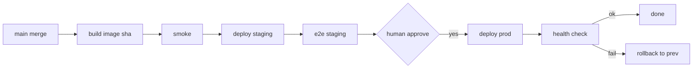

# 23 — DEPLOYMENT

---

## 1. Environment Model

| Environment | Purpose | Lifecycle | Egress |
|---|---|---|---|
| local | sandbox dev + integration tests | ephemeral (per run) | none |
| staging | pre-prod; full test surface | reusable | limited external |
| production | live app | persistent, blue/green ready | full |

MVP: **local Docker Compose only** (no staging/prod in cloud yet). Environments defined in
`deploy/environments/<env>/`.

---

## 2. Deployment Pipeline (per release)

```
merge to main
  → build artifact (Docker image, tagged sha+ts)
  → smoke tests on image
  → deploy to staging (auto at L3+; approval at L2)
  → full E2E on staging
  → [HUMAN APPROVAL required for production, always]
  → deploy to production (blue/green or rolling)
  → post-deploy health checks
  → rollback if health fails
  → tag release + update deploy_record artifact
```

---

## 3. Deployment Record

```yaml
deploy:
  id, project_id, task_id
  env, version_label
  image_tag: sha-ts
  commit_sha
  status: pending|running|healthy|degraded|failed|rolled_back
  health_checks: {http, tcp, log, process}
  duration_s
  prev_version_label
  performed_by: agent_id | human
  decision: approval_id
  rollback_id: deploy_id|null
  created_at, completed_at
```

---

## 4. Rollback

- **Trigger:** any health check failure after deploy.
- **Process:** mark failed; shift traffic back to previous healthy version (blue/green); mark
  `rolled_back`.
- **Code:** `git revert` the release commit on `main`; new deploy pipeline runs revert; only
  then is it valid (reverts also go through tests before prod deploy approval).

---

## 5. Database Migrations

- Migrations run as a separate `migration_task` before the main deploy and after merge to
  main.
- **Forward-only migrations** enforced; rollback migrations are written as separate down
  scripts and executed only during rollback events (separate approval).
- Migrations include a `down` script; verify both forward + backward test.
- Connection string: injected into sandbox via secret-store; no plaintext.

---

## 6. Health Checks & Smoke

Post-deploy health checks run in a **healthy** state: HTTP /health check, port reachability,
process alive, key log line emitted (e.g., "server started").

---

## 7. Environment Configuration

- Secrets per environment (staging/prod separate key vaults).
- `.env` templates in repo with `{placeholder}` replaced from vault at deploy time.
- No environment values in source code (except non-secret config).

---

## 8. Mermaid: Deploy Pipeline

