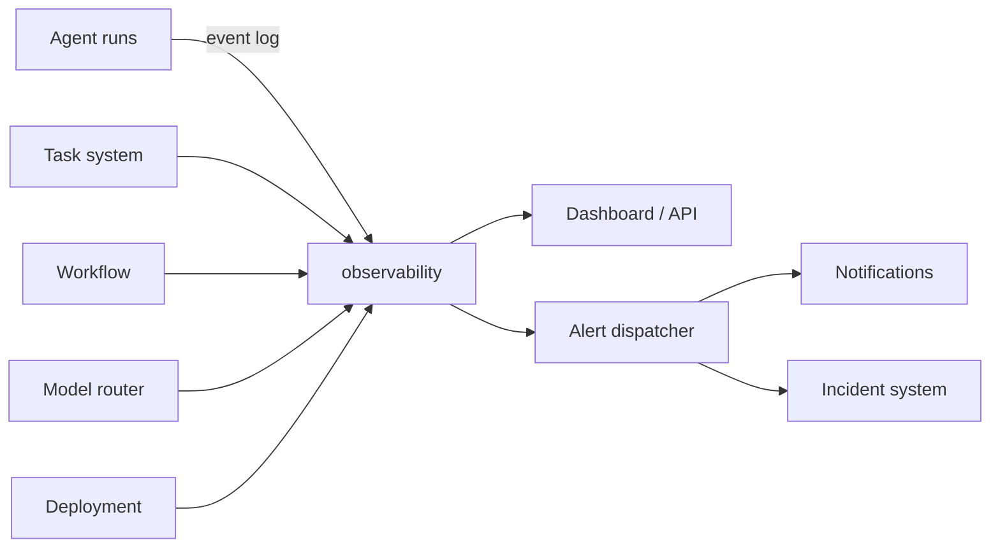

# 24 — MONITORING

---

## 1. Two Levels

| Level | Scope | Consumers |
|---|---|---|
| Platform monitoring | the AI orchestration system itself | operators |
| Application monitoring | deployed user projects | orchestrator, app users |

Both feed the same observability stack (see `27`).

---

## 2. Platform Monitoring Metrics

| Metric | Granularity | Purpose |
|---|---|---|
| agent_runs | start/end, success/fail, duration | health of agent fleet |
| task_queue_depth | by status/priority | backpressure detection |
| model_calls | token counts, cost, latency, provider | cost / quality monitoring |
| event_bus_lag | msgs/second, queue depth | pipeline latency |
| sandbox_pool | utilization, cold-start count | capacity planning |
| approval_pending | count + age | human bottleneck |
| cost_per_project | cumulative + burn rate | budget enforcement |
| failures_per_agent | rolling 24h | agent tuning |

---

## 3. Application Monitoring (deployed user apps)

Generated by the monitoring agent during deployment:

- HTTP latency (p50/p95/p99)
- Error rates (5xx, 4xx)
- Process health
- DB connection pool saturation
- Basic log-based anomaly (error rate spike)

Stored in `monitoring_config` artifact; platform pulls metrics if metrics exporter is
configured (MVP: skip real-time push; use post-deploy health checks only).

---

## 4. Alerting (MVP)

| Alert | Condition | Action |
|---|---|---|
| Critical agent failure | ≥3 failures/hour for same agent | incident raised |
| Budget burn | project cost > 80% of cap | budget_warning event |
| Approval stalled | pending > 72h | reminder notification |
| Sandbox OOM | sandbox killed | retry + capacity escalation |
| Workflow stuck | step with no transition for 2h | watchdog → orchestrator |
| Post-deploy health fail | health check x3 fail | rollback + incident |

All alerts: emitted as events (`monitoring.alert`) and visible in observability dashboard.

---

## 5. Logs

- Structured JSON logs for every major event (agent run start/end, task transitions, tool
  calls, approvals, deployments).
- Written to stdout → collected to local filesystem (MVP) or log store (v1).
- Log retention: 30 days operational; audit logs retained as per `18`.
- Secret scrubber pipeline filters log stream (regex + block function).

---

## 6. Tracing

- Full request trace: `trace_id` flows through API request → workflow → task → agent run →
  model call.
- Spans: task, agent run, model call, tool call, step execution.
- Stored in `trace_log` table; queryable for debugging.

---

## 7. Mermaid: Monitoring Architecture

