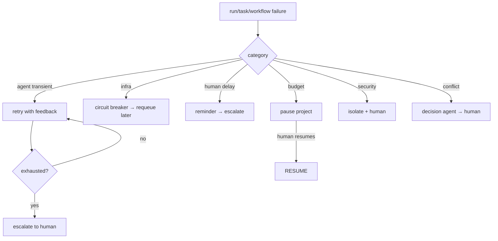

# 25 — ERROR RECOVERY

---

## 1. Failure Categories & Recovery Strategies

| Category | Examples | Default strategy |
|---|---|---|
| Agent run failed | model error, invalid output, tool error | retry (agent-level) per §2 |
| Task failed (permanent after retries) | repeated agent failures, dependency loop | create fix task or escalate |
| Workflow stuck | timeout, approval wait, event storm | watchdog; escalate after grace |
| Model provider failure | provider down, rate limit | fallback to next provider (12) |
| Sandbox failure | OOM, crash, eviction | requeue task to new sandbox |
| Tool failure (infra) | DB connection, git lock | transient retry; permanent = infra incident |
| Human delay | approval stale, feedback delayed | reminder → escalation |
| Budget exceeded | project cap hit | pause project; notify human |
| Security incident | breach, data exfiltration, malicious repo | isolate + human-activate |
| Data corruption | artifact hash mismatch, DB constraint | snapshot restore; incident |

---

## 2. Retry Policies

### Agent runs
- See `06` §3. max_attempts=3 (coding), backoff exp, feedback-based retry not raw retry.
- Exhausted → task FAILED with reason → escalation.

### Workflow steps
- Step-level retry: max=2, only on `retryable` step types.
- step failure → route to `on_failure` branch (orchestrator decides escalation or pause).

### Infrastructure (sandbox/DB/gatekeeper)
- Circuit breaker: >N failures/minute → open for T seconds; subsequent calls fail fast
  (saves model calls during infra downtime).

---

## 3. Escalation Ladder

| Attempt | Mechanism |
|---|---|
| run failed (attempt 1) | automatic retry (same agent) |
| run failed (attempt 2) | re-prompt with richer context (different agent in same skill?) |
| run failed (attempt 3) | escalate to orchestrator → human: "this task needs manual help" |
| task stuck > timeout | watchdog event → orchestrator decides force-continue, cancel, or human |
| budget exceeded | hard pause → human must acknowledge + approve reset |
| security incident | immediate isolation + human activation; no auto-resume |

---

## 4. Conflict Between Agents

When reviewer says REQUEST_CHANGES and dev says "not a bug":
- Decision agent evaluates evidence; if cannot resolve → BLOCKED task → human.

When architecture agent disagrees with security agent:
- Orchestrator solicits both artifacts; if gap remains → human decision via approval
  packet with both options.

---

## 5. Infinite Loop Detection

- Workflow watchdog: if any workflow step executed > K times (configurable, default 6)
  without advancing → forced PAUSE + incident.
- Task retry loop: if the same task has gone through > max_agent_retries + max_step_retries
  total attempts
  with same root cause → BLOCKED.

---

## 6. Crash Recovery

- On system restart: 
  1. Scan `agent_run` in RUNNING (lease expired) → requeue to READY.
  2. Scan `workflow_run` in RUNNING → recover from last completed step (idempotent re-execute).
  3. Scan `workflow_run` in PAUSED → re-emit approval request (idempotent) and remain PAUSED.
  4. Reconnect event bus dispatcher from outbox tail.

---

## 7. Rollback as Recovery

- Code rollback: `git revert` (see `23`).
- Architecture rollback: revert to previous architecture artifact + rebuild tasks.
- State rollback: restore from stage transition snapshot (see `13`).

---

## 8. Incident Records

```yaml
incident:
  id, project_id
  category: failure | security | budget | data_corruption
  severity: p1_critical | p2_high | p3_medium
  status: open | investigating | resolved | postmortem_done
  trigger_event_id
  mitigation: str
  resolution: str
  linked_tasks: [task_id]
  resolved_by: human | auto
  opened_at, resolved_at
```

Postmortems stored as org memory lessons (see `10`).

---

## 9. Mermaid: Error Recovery Flow

