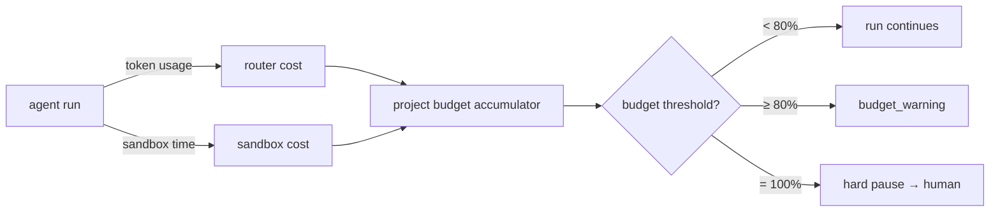

# 26 — COST CONTROL

---

## 1. Cost Model

Costs flow from:

| Source | Unit | Capture point |
|---|---|---|
| LLM tokens | per token (in/out) per provider | model router on every call |
| Embedding calls | per text unit | embedding service |
| Sandbox compute | wall-clock × container resource | sandbox gatekeeper |
| External API (search) | per call | tool exec |
| Storage | per artifact MB | artifact system |
| Database | per query (estimated) | query counter |

MVP: only token costs and sandbox compute are tracked (highest variance).

---

## 2. Budget Hierarchy

```
Organization budget
 └── per-project budget
      └── per-milestone budget (optional)
           └── per-task budget (agent cap)
```

Budgets stored in project config (`project.config.budgets`) and enforced at:
- **Pre-flight:** model router projects cost before a run and blocks if task cap exceeded.
- **Post-flight:** on run completion, actual cost recorded; project total updated.
- **Alerting:** at 80% warn, 100% hard-stop (task paused, human notified). Per `24`.

---

## 3. Model Routing for Cost

- Router scores cost vs quality vs latency (see `12` §4).
- Tasks with low complexity get the cheapest adequate model.
- High-stakes tasks (architecture, security analysis, complex coding) may use premium
  models within budget.
- Org-level setting: cost ceiling per task default (e.g., $2). Any task exceeding → approval
  required.

---

## 4. Caching & Deduplication

- **Semantic cache:** same (or near-identical) prompt seen before for this project can return
  cached result (configurable, off by default for code generation, safe for research).
- **Embedding cache:** reuse embeddings by content hash; avoid re-embed on re-inject.
- **Build cache:** Docker layer caches shared across project runs of same image config.

---

## 5. Context Budget & Compression

- All agents have a `context_budget_tokens` cap per run.
- Overflow mitigation: summarization of low-priority context before inclusion (see `09` §6).
- Compression via: nested summaries, dropping low-relevance memory hits, structured artifact
  summaries over raw.

---

## 6. Observability & Chargeback

- Every run records `cost_usd` + `token_usage` + `provider`.
- Dashboard: project total, per-task, per-agent, per-model.
- Export for invoicing (v2 SaaS model).

---

## 7. Safeguards

| Safeguard | Behaviour |
|---|---|
| project cost cap hard | workflow paused; notification; reset only by human |
| task cost soft | warning event; allow (for model uncertainty) |
| task cost hard | RUN FAILED immediately; requeue only if human opts in |
| provider failover | cheaper fallback; no cost to user |
| sandbox idle | hot container GC after 1h inactivity |

---

## 8. Mermaid: Cost Flow

