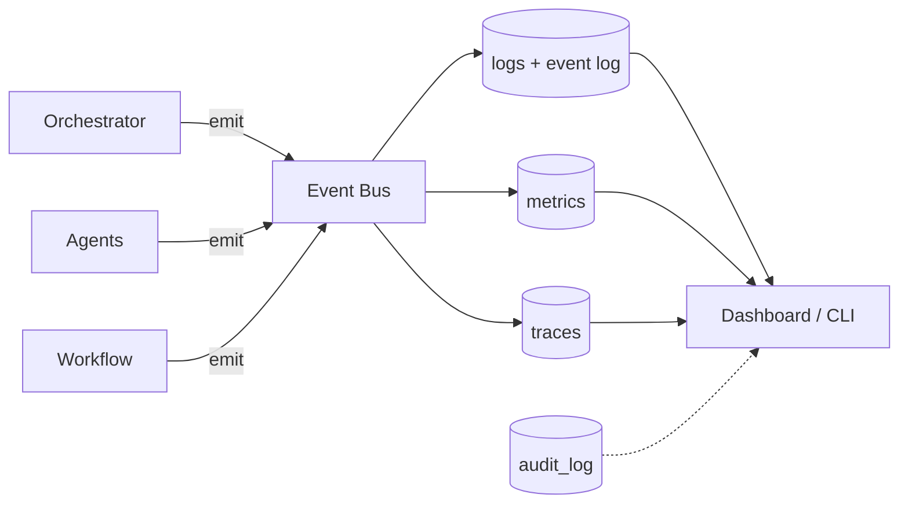

# 27 — OBSERVABILITY

---

## 1. Three Pillars

| Pillar | What | Storage | Query |
|---|---|---|---|
| Logs | structured event lines | stdout → file/log store | grep + trace_id |
| Metrics | numeric counters/gauges | time-series table (PostgreSQL) | SQL aggregate queries |
| Traces | causal call trees | span table | trace_id tree |

---

## 2. Logging Convention

Every component emits JSON lines with mandatory fields:

```json
{
  "ts": "ISO8601",
  "level": "info|warn|error|critical",
  "component": "agent_runtime|task_system|workflow|...",
  "project_id": "uuid",
  "trace_id": "uuid",
  "span_id": "uuid",
  "event": "tool_call|task_completed|...",
  "detail": {}
}
```

---

## 3. Metrics Catalogue

| Metric | Type | Labels |
|---|---|---|
| `agent_runs_total` | counter | agent_id, status |
| `agent_run_duration_seconds` | histogram | agent_id |
| `model_tokens_in/out` | counter | model, provider, task_type |
| `model_call_latency_seconds` | histogram | model, provider |
| `model_cost_usd` | counter | model, provider, project_id |
| `task_queue_depth` | gauge | status, priority |
| `task_completed_total` | counter | project_id |
| `approval_pending` | gauge | project_id, age_seconds |
| `sandbox_pool_utilization` | gauge | project_id |
| `workflow_run_state` | gauge | project_id, status |
| `budget_usd_project` | gauge | project_id |
| `test_runs_total` | counter | filter, status |

---

## 4. Trace Model

- Every API request and workflow run gets a `trace_id`.
- Spans: workflow step → task → agent_run → model_call / tool_call.
- Causal links: `parent_span_id` tree.
- Stored in `span` table (PostgreSQL) with start/end/attributes.
- Query: "show me everything that happened for project X during the PRD stage".

---

## 5. Audit Trail

Distinct from operational logs: append-only table `audit_log` with entries:

```yaml
audit:
  id, ts
  action: user.login|stage.transition|approval.decision|deploy.executed|secret.read
  subject: user_id | agent_id
  project_id
  resource_type, resource_id
  before, after (for mutations)
  trace_id
```

Immutability: rows are append-only; delete/update blocked at DB level (stored procedure or
role permission).

---

## 6. Dashboard (API-first)

MVP provides query APIs; v1 provides a UI:

- `/metrics/project/:id`: summary, budget, cost, task stats.
- `/metrics/agent`: fleet health, failure rates, cost per model.
- `/dashboard/project/:id`: stage progress, current tasks, recent events.

---

## 7. Mermaid: Observability Flow

