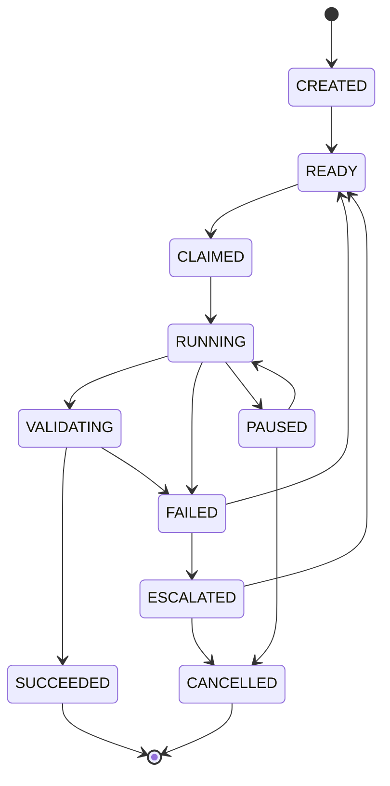
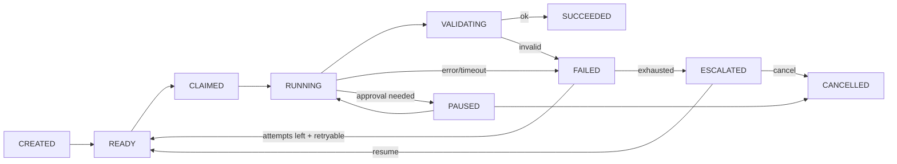

# 37 — AGENT STATE MACHINE

---

## 1. Two Related State Machines

1. **Task state machine** (see `08`) — the lifecycle of the *task*.
2. **Agent run state machine** (this document) — the lifecycle of one *execution attempt*.

They are linked: task RUNNING == an agent_run in progress; task REVIEW == run SUCCEEDED and
produced artifacts; etc.

---

## 2. Agent Run States (canonical)

### 2.1 State details

| State | Meaning | Entry condition | Exit conditions |
|---|---|---|---|
| CREATED | Run record exists | task assignment / spawn | context injected |
| READY | In queue, waiting worker | deps met, budget calc passed | worker claims |
| CLAIMED | Worker reserved (lease) | lease acquired (TTL 60s) | lease ok → RUNNING; lease expired → READY |
| RUNNING | Model/tool loop | claim committed | model output / tool done / error / timeout |
| VALIDATING | Output post-check | model returned output | schema ok → SUCCEEDED; else FAILED |
| PAUSED | Human approval mid-run (rare) | approval required encountered | decision → RUNNING or CANCELLED |
| SUCCEEDED | Output validated, artifacts recorded | validation passed | terminal |
| FAILED | Non-terminal (attempt); triggers retry | error/validation fail | policy: retry → READY (new attempt) or ESCALATED |
| ESCALATED | Waits orchestrator/human | retries exhausted or blocked | decision → READY (new run) or CANCELLED |
| CANCELLED | Aborted (human/workflow) | cancel | terminal |

---

## 3. Transition Guards

Every transition is guarded by logic; invalid transitions are logged as
`agent_run.illegal_transition`.

| From → To | Guard |
|---|---|
| CREATED → READY | context assembly success; budget pre-check pass |
| READY → CLAIMED | worker available; sandbox pool slot free |
| CLAIMED → RUNNING | lease valid |
| RUNNING → VALIDATING | model returns; tool loop complete |
| RUNNING → FAILED | error/timeout or cost hard-cap |
| VALIDATING → SUCCEEDED | schema valid; required artifacts exist; budget respected |
| VALIDATING → FAILED | schema invalid or artifact missing |
| FAILED → READY | attempt < max_attempts AND error retryable |
| FAILED → ESCALATED | attempts exhausted or non-retryable critical |
| PAUSED → RUNNING | approval.approved / resume signal |
| ESCALATED → READY | orchestrator resumes (new attempt with upgraded context) |
| ESCALATED → CANCELLED | orchestrator/human cancels |

---

## 4. Events Emitted

| State change | Event |
|---|---|
| CREATED | `agent_run.created` |
| READY | `agent_run.ready` |
| CLAIMED | `agent_run.claimed` |
| RUNNING | `agent_run.started` |
| (tool call) | `agent_run.tool_call` |
| SUCCEEDED | `agent_run.succeeded` |
| FAILED | `agent_run.failed` (with reason + retryable flag) |
| ESCALATED | `agent_run.escalated` |
| PAUSED | `agent_run.paused` |
| CANCELLED | `agent_run.cancelled` |

---

## 5. Attempt Management

- `agent_run.attempt` increments per new run row for a task.
- Attempt merges into the same `task_id`.
- The fixer loop (different task type `fix`) is tracked via task lineage, not run attempts.

---

## 6. Retry Policy Enforcement (summary)

| Signal | Behavior |
|---|---|
| transient model error | retry same model ×2 backoff |
| validation failed | feedback-reprompt (new context) ×2 |
| tool error | retry tool ×2 with error in context |
| attempts exhausted | FAILED → ESCALATED (orchestrator/human) |
| cost hard-cap hit mid-run | FAILED immediately with `cost_cap` reason |

---

## 7. Mermaid: State + Failure Flow

