# 38 — PROJECT PIPELINE

---

## 1. Canonical Stage Flow

```
IDEA → INTAKE → RESEARCH → VALIDATION → PRD → ARCHITECTURE → ROADMAP →
TASK_GENERATION → DEVELOPMENT → QA → SECURITY → DEPLOYMENT → MONITORING → MAINTENANCE → IMPROVEMENT
```

Each stage is executed by the workflow engine (definition: `project_build.yaml`). The
orchestrator owns the stage transition; `17_HUMAN_APPROVAL.md` governs gates.

---

## 2. Stage Specifications

### 2.1 IDEA
- **Responsible:** Human → Orchestrator (intake acceptance).
- **Inputs:** free text idea, brief.
- **Outputs:** intake record artifact.
- **Entry:** any.
- **Exit:** intake record created (unvalidated).

### 2.2 INTAKE
- **Responsible:** Orchestrator + Requirements Agent.
- **Inputs:** intake record.
- **Activity:** clarifying-question loop (up to N rounds, default 3), structured problem
  statement, target user, scope + constraints, success criteria, NFR hints.
- **Outputs:** `intake.md` artifact (v1).
- **Exit:** clarity score ≥ threshold; else escalate to human for input.

### 2.3 RESEARCH
- **Responsible:** Research Dept (fan_out market/competitor/technical).
- **Inputs:** intake.md.
- **Outputs:** `market_report.md`, `competitor_report.md`, `tech_research.md` (cited).
- **Exit:** all three final or explicit human waiver to skip market research for internal
  tooling.

### 2.4 VALIDATION
- **Responsible:** Orchestrator + Decision Agent.
- **Inputs:** research artifacts + intake.
- **Activities:** feasibility score (technical + cost + timeline), risk register init,
  **Go / Pivot / No-Go** recommendation.
- **Outputs:** `feasibility_report.md`.
- **Gate P4:** human approves Go at L<3; orchestration-level only at ≥L3.

### 2.5 PRD
- **Responsible:** Product Manager + BA + Requirements Agent.
- **Inputs:** validated intake + research.
- **Outputs:** `prd.md`, `user_stories.md`, `acceptance_criteria.md`, `success_metrics.md`.
- **Gate P5 (T2):** human approval at L<4.
- **Exit:** PRD approved; else refine loop (max 2, then escalate).

### 2.6 ARCHITECTURE
- **Responsible:** Architecture Dept.
- **Inputs:** PRD + tech research.
- **Outputs:** `system_architecture.md`, `data_model.md`, `security_architecture.md`,
  `deployment_architecture.md`, `tech_selection.md`, ADRs.
- **Gate P6 (T2):** human approval at L<4.
- **Exit:** approved architecture; conflicts resolved via Decision Agent.

### 2.7 ROADMAP
- **Responsible:** PM Agent (planning).
- **Inputs:** PRD + architecture.
- **Outputs:** `roadmap.md` (milestones, epics, dependencies, estimates, capacity plan).
- **Gate:** auto at L3.

### 2.8 TASK_GENERATION
- **Responsible:** Orchestrator + PM (epic → task decomposition).
- **Inputs:** roadmap.
- **Outputs:** task set (in task system) with dependencies + estimates + write-scopes.
- **Exit:** all epics decomposed; dep DAG acyclic.

### 2.9 DEVELOPMENT
- **Responsible:** Dev Dept (parallel per write-scope).
- **Inputs:** tasks.
- **Cycle:** assign → code → tests → commit → REVIEW → APPROVE → merge.
- **Outputs:** code in main branch, test suite, coverage report.
- **Exit:** all development tasks APPROVED + merged; pipeline green.

### 2.10 QA
- **Responsible:** Quality Dept.
- **Inputs:** merged code.
- **Activities:** full test layers (21), coverage audit vs acceptance criteria, regression
  on main.
- **Outputs:** `qa_report.md` + TestRun records.
- **Gate P7 (T2):** human approves QA sign-off at L<4 (regression risk).
- **Exit:** QA pass or waiver.

### 2.11 SECURITY
- **Responsible:** Security Agents.
- **Inputs:** repo snapshot.
- **Activities:** SAST, dependency audit, secret scan, threat-model check.
- **Outputs:** `security_report.md` findings.
- **Gate P8 (T2):** human approves if any critical/high finding exists.
- **Exit:** no critical open findings; highs fixed or explicitly waived.

### 2.12 DEPLOYMENT
- **Responsible:** DevOps Dept.
- **Inputs:** release candidate SHA.
- **Gate P9 (T3, always):** human approves production deployment.
- **Outputs:** deploy_record, running service.
- **Exit:** health checks green.

### 2.13 MONITORING
- **Responsible:** Monitoring Agent (+ platform monitoring).
- **Inputs:** deployed app + config.
- **Outputs:** monitoring_config, baseline metrics, alert rules.
- **Exit:** baseline established; alerts active.

### 2.14 MAINTENANCE
- **Responsible:** Orchestrator + DevOps.
- **Inputs:** incidents, log anomalies, user feedback.
- **Behavior:** triage → maintenance tasks (fix/enhance/docs) → new build workflow branch.
- **Exit:** work items closed or backlogged with priority.

### 2.15 IMPROVEMENT
- **Responsible:** Orchestrator + Retrospective Agent.
- **Inputs:** project run metrics + postmortems.
- **Outputs:** retrospective.md → org memory lessons, template updates (reviewed before
  publish).
- **Exit:** lessons registered, plan closed or continued.

---

## 3. Stage Gate Table

| # | Gate | Tier | Level where human-required |
|---|---|---|---|
| P4 | Go decision | T2 | L<3 |
| P5 | PRD approval | T2 | L<4 |
| P6 | Architecture approval | T2 | L<4 |
| P7 | QA sign-off | T2 | L<4 |
| P8 | Security sign-off | T2 | L<4 (always if critical) |
| P9 | Production deploy | T3 | **Always** |

---

## 4. Mermaid: Pipeline

```mermaid
flowchart LR
  A[IDEA] --> B[INTAKE] --> C[RESEARCH] --> D[VALIDATION]
  D -->|Go| E[PRD] -->|P5 human| F[ARCHITECTURE] -->|P6 human| G[ROADMAP]
  G --> H[TASK_GENERATION] --> I[DEVELOPMENT]
  I --> J[QA] -->|P7| K[SECURITY] -->|P8| L[DEPLOYMENT] -->|P9 always human| M[MONITORING]
  M --> N[MAINTENANCE] --> O[IMPROVEMENT]
  O -.->|lessons| B
```

