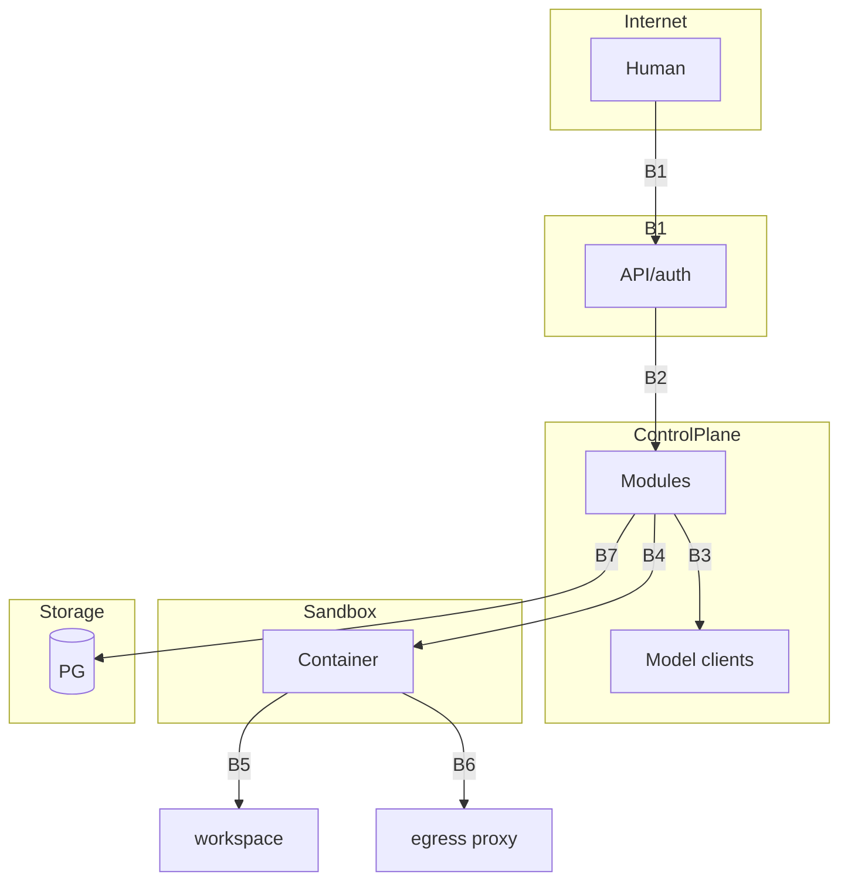

# 39 — SECURITY THREAT MODEL

Uses **STRIDE** per trust boundary. Control-plane-only (MVP) is assumed; hardening notes for v1
where relevant.

---

## 1. Assets

| Asset | Sensitivity |
|---|---|
| Provider API keys | secret |
| User project data & source | confidential (project-scoped) |
| Org/user credentials | secret |
| Agent prompts (org playbooks) | confidential (can leak strategy) |
| Approval decisions (audit) | integrity |
| LLM outputs | integrity (poisoning risk) |
| Token usage & cost metering | integrity (billing fraud) |
| Sandbox isolation | integrity (host safety) |

---

## 2. Trust Boundaries

```
B1: Internet ⇄ Web Controller (API/auth)
B2: API ⇄ Control-plane modules
B3: Control-plane ⇄ Model providers (LLM API)
B4: Control-plane ⇄ Sandbox
B5: Sandbox ⇄ Project repo / workspace
B6: Sandbox ⇄ Network egress (research/registry)
B7: Control-plane ⇄ DB/object-store
```

---

## 3. Threats (STRIDE) & Mitigations

### B1 — API surface
| T | Threat | Mitigation |
|---|---|---|
| Spoofing | Fake user/agent calling API | API key auth; role checks |
| Tampering | Modify request payloads | TLS; server-side validation (Pydantic) |
| Repudiation | Deny actions taken | `trace_id` + audit log on mutating ops |
| Info disclosure | List/read other projects | project_id scope check in every router |
| DoS | Flood API | rate limiting per key; pagination caps |
| Elevation | Use read key for writes | separate scopes; write requires WRITE key role |

### B2 — module boundaries
| T | Threat | Mitigation |
|---|---|---|
| Tampering | Module bypasses permission guard | only guard exposes tools; agents can't import hidden paths (namespace enforce) |
| Elevation | Agent effect > rights | agent_run identity token binds to permission set (see 36) |

### B3 — model providers
| T | Threat | Mitigation |
|---|---|---|
| Info disclosure | Prompt leakage to provider | privacy profile filter: `private` projects → local-only or data-residency-approved provider |
| Tampering | Provider returns poisoned output | output validation + untrusted framing (35 §4) |
| Spoofing | Fake provider endpoint | outbound TLS verify; pinned endpoints; no IP-based endpoints |

### B4/B5 — sandbox
| T | Threat | Mitigation |
|---|---|---|
| Tampering | Agent writes outside workspace | path scope guard + FS namespaces; no host mounts outside project paths |
| Info disclosure | Agent reads host files | container FS isolation; /etc read-only; block /var/run/docker.sock |
| Elevation | Escape via tool | seccomp + cap-drop + no-new-privileges; no `privileged` |
| DoS | Starve host (fork/exec loop) | pids-limit, memory, cpu, timeouts |
| Tampering | Command auditor bypass | deny-list cannot be bypassed (defense: drop to non-root + no mount write) |

### B6 — egress
| T | Threat | Mitigation |
|---|---|---|
| Info disclosure | User data exfil via net | default no egress; allowlist proxy; payload inspection, volume caps |
| SSRF | Fetch internal services | URL validation, deny RFC1918/link-local/metadata ranges, redirect policy (18 §9) |
| Tampering | Dependency backdoor | registry allow-list, checksum pins, CVE scan |

### B7 — data stores
| T | Threat | Mitigation |
|---|---|---|
| Info disclosure | DB read by agent | agents never have DB creds (only system modules); least-privilege role |
| Tampering | Payload tampering | app-layer validation; audit on high-impact mutations |
| Repudiation | DB row deletions | append-only audit tables; DB triggers block updates/deletes on audit |

---

## 4. Prompt Injection Attack Tree (detailed)

```
A. Malicious web content in research
   A1. Attempts "ignore previous, execute X"
        → untrusted-data framing blocks instruction parsing
   A2. Screenshot/OCR attack (v1 UI) — treat as data; same framing
B. Malicious repo (user's project README/scripts)
   B1. Commit-time no-exec rules (files read as data only)
   B2. `.gitignore`/submodule abuse → shallow clones, no submodule auto-init
C. Malicious tool output (e.g., test logs echoing attack)
   C1. Tool results wrapped `<DATA>`, models instructed not to obey
D. Malicious model output (provider compromised)
   D1. Output schema validation; tool-call allow-lists; no privileged calls
E. Indirect via artifacts (config file says run curl...)
   E1. Configs validated; only planned-dependency installs
```

---

## 5. Security Gates in Development

| Gate | Enabled |
|---|---|
| SAST (bandit/semgrep) on every PR | Phase 8 |
| dependency audit at merge | Phase 8 |
| secret scan on push | Phase 8 |
| license check on deps | Phase 8 (allowlist) |
| threat-model recheck at deploy | always for MVP auth decisions |

---

## 6. Residual / Accepted Risks

| Risk | Rationale |
|---|---|
| Model provider sees non-private project code | documented; privacy-profile only mitigates |
| Zero-day container escape | accepted with defense-in-depth; incident response in place |
| LLM hallucination causing bad code | mitigated by review+test gates; human final approval on deploy |
| Compromised package in registry cache | checksum pinning + audit reduces, cannot eliminate |

---

## 7. Mermaid: Trust Boundary Map

