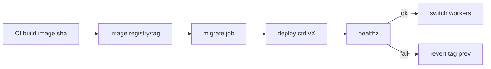

# 41 — DEPLOYMENT STRATEGY

---

## 1. Deployable Units

1. **Control plane** (API + workers) — one Docker image `aiagent-ctrl:vX`.
2. **Database** — PostgreSQL 16 container (with pgvector module).
3. **Sandbox pool** — pre-built `aiagent-sandbox:py312-node20` image.
4. **Optional later**: object-store (MinIO), Redis, dashboard.

---

## 2. Environments

| Env | Where | Purpose | Deploy frequency |
|---|---|---|---|
| local (dev) | dev machine via `docker compose up` | development + demo | on demand |
| staging | self-hosted (optional) | integration with real-ish data, nightly E2E-real | on release |
| production | self-hosted or cloud | serve org using the platform | gated release |

MVP: local only (`deploy/environments/local/docker-compose.yaml`).

---

## 3. Control Plane Deployment (platform self-hosting)

- Image built from `deploy/docker/Dockerfile.ctrl`; pinned Python 3.12-slim digest.
- Non-root user; reads config from mounted volume `config/` (no secrets).
- DB connection via env-injected DSN (from secret store).
- Container resource limits: 1 CPU, 2 GiB (MVP small).
- Health check: `/healthz` endpoint + DB ping.

### Migrations
- Alembic migrate run as a one-off `migrate` job before API starts (entrypoint checks).

---

## 4. Sandbox Pool Deployment

- Pre-provisioned `aiagent-sandbox` images with both Python and Node runtimes.
- Warm pool: 4 containers per project (MVP) spawned by gatekeeper in the same compose
  network.
- **Shared network:** `aiagent-net`; sandboxes have no published host ports (local-only
  networking inside stack).
- Sandbox images rebuilt weekly (OS patches) and scanned.

---

## 5. Deploy Playbook (commit → running)

```yaml
trigger: CI pipeline on main (or local script)
steps:
  - build ctrl image (tag: sha)
  - run migrations (new version)
  - start new ctrl container
  - healthz probe (wait loop, 30s)
  - switch discovery label (compose service alias) for workers
  - tail: old container stop
rollback: retain previous image tag; `compose down/up` with old tag; migrations only
          rollforward (down-migrations isolated, approval-gated)
```

---

## 6. Upgrade / Downgrade Policy

- **Upgrades** are forward-only; schema migrations reversible via Alembic down (but platform
  policy: forward-only except emergency).
- **Rollback of code:** `compose` pointed at previous image tag.
- **Rollback of data:** restore from `project_state_snapshot` (13) if needed; data-loss
  risk documented for each snapshot.

---

## 7. Release Cadence

- Trunk-based: every merge to `main` produces `:sha` image; tags for staged releases
  (`v0.1.0`).
- `CHANGELOG.md` auto-drafted from conventional commits on merge.

---

## 8. Mermaid: Deploy Pipeline (platform)

