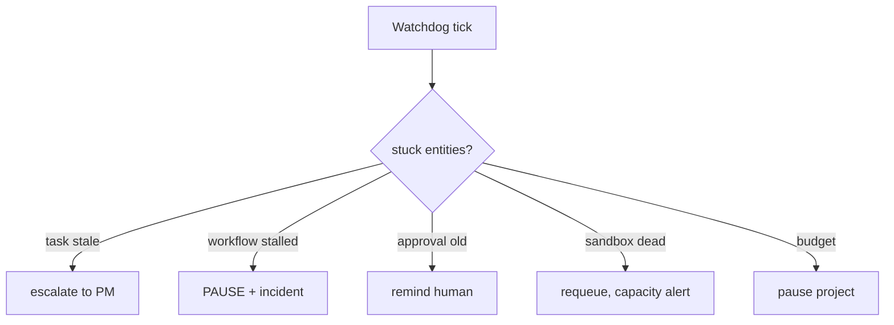

# 43 — FAILURE SCENARIOS

Enumerated failure scenarios with detection, response, and prevention. This is the
operational companion to `25_ERROR_RECOVERY.md`.

---

## 1. Agent / Run Failures

| Scenario | Detection | Response | Prevention |
|---|---|---|---|
| Model returns garbage | output validation fail | feedback-reprompt ×2 → escalate | better schemas, better prompts |
| Model call times out | run timeout | FAILED(retry) ×3 → escalate | lower context size, retry policy |
| Model API 401/403 | provider auth error | immediate FAILED (non-retry) → alert | key rotation monitoring |
| Tool call blocked repeatedly | guard deny log | model adapts; repeated → FAILED reasons | verify agent def perms |
| Tool returns unexpected schema | tool schema validation | error to model → retry tool ×2 | tool schema tests |
| Sandbox OOM / eviction | sandbox kill event | requeue; capacity alert | pool sizing, mem limits |

---

## 2. Task / Workflow Failures

| Scenario | Detection | Response | Prevention |
|---|---|---|---|
| Dependency DAG cycle | creation-time check | reject creation with planner error | planner validation |
| Task never becomes READY | watchdog (stale CREATED/DRAFTING) | escalate to PM | input validation |
| Deadlock (two fixes depend on each other) | cycle check on new edge | block edge, create decision task | cycle prevention |
| Workflow stuck 2h | step watchdog | PAUSE + incident + orchestrator | step budgets, timeouts |
| Approval ignored 72h | approval timer | reminders ×2 → page human | approval SLA |
| Cost cap reached mid-run | cost monitor | RUN FAILED (cost_cap) | pre-flight estimate |

---

## 3. Integration Failures

| Scenario | Detection | Response | Prevention |
|---|---|---|---|
| Database down | connection errors | circuit breaker; retry; incident | health checks, pg pool |
| Outbox lag / event loss | outbox processor lag metric | replay outbox on restart | allowed in design (16) |
| Object storage unavailable | artifact write failure | task FAILED (retryable) | storage checks |
| Git remote locked | git error on push | retry with backoff; report | branch rules, lock tool |
| Provider key quota exhausted | provider 429 | switch fallback provider | quota monitoring |

---

## 4. Security Failures

| Scenario | Detection | Response | Prevention |
|---|---|---|---|
| Secret leak in log | scrubber + shape scan | redact, rotate, incident | no-secrets policy, guardrails |
| Prompt injection triggered | model tries disallowed tool | tool blocked; trace agent; review outputs | untrusted framing (35) |
| Malicious repo push | scan at validate stage | reject commit, quarantine, human | scan gates (22) |
| Egress anomaly (exfil) | volume/pattern monitor | kill sandbox, revoke, incident | egress allowlist |

---

## 5. Testing / Quality Failures

| Scenario | Detection | Response |
|---|---|---|
| Test suite flaky (flaky=retries ≤3 still random) | flake tracking | quarantine test, alert QA lead, human fix |
| Coverage below bar | coverage gate | block merge; fix-tasks; waiver needs human |
| Reviewer and author disagree (loop) | change-request counter | after 3 change requests → BLOCKED decision (human) |

---

## 6. Human-Triggered Escalations

| Scenario | Response |
|---|---|
| Human pauses project | all runs cancelable; workflow PAUSED; sandbox recycled; memory retained |
| Human overrides autonomy level | gates re-evaluated immediately; pending approvals re-tiered |
| Human cancels a task/workflow | children cancelled; compensating steps; audit recorded |

---

## 7. Compounding Failure Protection

- **Bulkhead pattern:** one project's failure (sandbox busy, budget runout) never blocks
  other projects (separate pools, quotas).
- **Failure router:** at most one escalation per failing unit is dispatched at a time
  (avoid event storms collapsing into one human ticket).

---

## 8. Mermaid: Watchdog Flow

