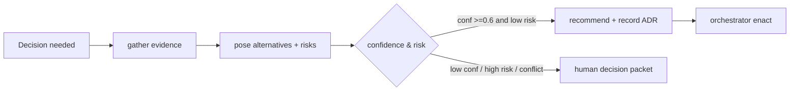

# 44 — DECISION FRAMEWORK

---

## 1. Purpose

Standardize how agents evaluate choices so decisions are **auditable, evidence-based, and
escalatable** rather than arbitrary. Applies to: feasibility (Go/No-Go), architecture
choices, conflict resolution, fix-or-revert, approval recommendations.

---

## 2. Decision Record Structure

An agent producing a decision writes a **Decision Packet**:

```yaml
decision:
  id, task_id, project_id
  question: str
  confidence: 0..1            # agent's own confidence
  evidence:
    - {type: artifact|test|metric|source, ref, summary}
  alternatives:
    - {option, pros, cons, cost_est, risk, confidence}
  recommendation: option_id
  risk_assessment:
    severity: low|medium|high
    reversibility: high|low
    blast_radius: this task | feature | project
  escalation:
    needed: bool
    reason: str   # "unresolved conflict", "low confidence", "high risk"
    to: pm | orchestrator | human
  created_by_run: run_id
```

---

## 3. Reversal Authority Rules

| Decision type | Reversible by | Requires |
|---|---|---|
| Task implementation approach | dev agent w/ review | APPROVE verdict |
| Architecture choice | orchestrator | P6 approval/ADR |
| Go/No-Go | orchestrator + human (L<3) | P4 approval |
| Rollback a release | deployment agent | human for prod (T3) |
| Abandon a feature | human only | approval |
| Change autonomy level | human only | admin action |

---

## 4. Escalation Triggers

Escalate when ANY applies:
1. `confidence < 0.6` for an important choice.
2. Two agents give contradictory evidence-backed recommendations.
3. Decision has high risk OR low reversibility.
4. Cost/time estimate exceeds project budget threshold.
5. Policy/security violation involved (always escalate).
6. Requirement ambiguity that can't be resolved within 2 clarify rounds.

---

## 5. Conflict Resolution Protocol

```
1. Both sides write decision packets with evidence.
2. Decision Agent compares: same data? contradictory data?
   - same data → likely interpretation difference → produce both options + tradeoffs
3. Orchestrator picks if risk is low and reversibility high (records ADR).
4. Otherwise → human decision packet (both options, impact, recommendation).
5. Losing option recorded to org memory as "considered and rejected" (prevents re-derivation).
```

---

## 6. Confidence Calibration

- Agents report confidence; system audits calibration offline: when humans disagreed with
  high-confidence decisions, agent confidence was miscalibrated → corrective prompt/lesson.
- No numeric floor universal; each decision type has floor/default.

---

## 7. Mermaid: Decision Flow

