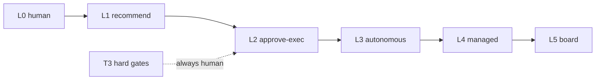

# 45 — AUTONOMY LEVELS

---

## 1. Level Definitions

| Level | Name | Human role | System autonomy |
|---|---|---|---|
| L0 | Fully manual | performs every action | recommendation only |
| L1 | AI recommends | approves each recommendation | proposes, does nothing itself |
| L2 | AI executes w/ approval | approves before execution | executes standard work; requires approval for each task/stage |
| L3 | AI executes most autonomously | stage-gate approvals only | runs tasks seamlessly; T2 gates |
| L4 | AI manages projects | milestone/deploy approvals | sets roadmap&schedule; gates T2 auto-reviewed but log-visible |
| L5 | Board oversight | board-level only | runs everything; humans see telemetry + exception reports |

---

## 2. Operation→Approval Mapping

| Operation tier | L0 | L1 | L2 | L3 | L4 | L5 |
|---|---|---|---|---|---|---|
| Read-only research / draft docs | H | H | AI | AI | AI | AI |
| Internal drafting (PRD drafts) | H | H | AI | AI | AI | AI |
| Feature code on branch | H | H | AI (per-fix approval) | AI | AI | AI |
| Merge to main (reviewed) | H | H | H | AI | AI | AI |
| PRD finalize (T2) | H | H | H | H | AI | AI |
| Architecture approve (T2) | H | H | H | H | AI | AI |
| QA sign-off (T2) | H | H | H | H | AI | AI |
| Security sign-off (critical) | H | H | H | H | H→AI(alert) | AI(alert) |
| Prod deploy (T3) | H | H | H | H | H | H |
| External spend (T3) | H | H | H | H | H | H |
| Credential change (T3) | H | H | H | H | H | H |

H = human required. "H→AI(alert)" = human still approves high-severity but alerts are
systemic.

---

## 3. Rules that Hold at ALL Levels

- T3 gates are **never auto-approved** (prod deploy, external spend, credential change).
- Human may always pause/cancel/override anything.
- Audit always on; autonomy level change requires human admin action.
- Level defaults: org default L2; per-project override allowed (admin).

---

## 4. Recommended Defaults

| Context | Default level |
|---|---|
| MVP first run | L2 |
| After trust established | L3 |
| Full autonomous demo | L4 |
| Internal experimentation | L2 with dev-only projects |

---

## 5. Level Transition Effects

When level changes mid-project:
- Pending approvals re-evaluated (gates may toggle on/off).
- Workflows re-consult gate config at next step, not retroactively.
- Counters (human approval counts) reset for the new level period.

---

## 6. Mermaid: Autonomy Spectrum

