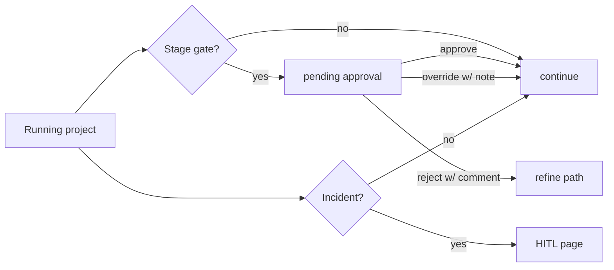

# 46 — HUMAN-IN-THE-LOOP

---

## 1. Where Humans Intervene

| Intervention point | Frequency | Innovation |
|---|---|---|
| Idea intake & clarification | per project | synchronous at start |
| Stage gates (P4-P9) | per stage | async via approval packets |
| Conflict mediation | as needed | async |
| Emergency / pause / overrides | rare | immediate |
| Retrospective review (improvement) | per project end | async |
| Security incident | rare | immediate |

---

## 2. Approval UX Contract

- Every approval packet = one decision request: {what, why, impact, material, deadline}.
- Human may comment **structurally** (free text + optional structured tags:
  `BLOCKER`, `ACTION-REQUIRED`, `QUESTION`).
- Human sees **full background**: artifacts pinned by version, diffs, tests run, costs.

---

## 3. Notifications

- Email/webhook (configurable): new approval, stage gate reached, incident, budget warning,
  review waiting, workflow paused.
- MVP: notifications are API-pollable events + optional email.

---

## 4. Delegation

- A human can delegate approval authority for a **tier** to another human (never to an
  agent) for a bounded window.
- Delegation is logged; ∂requires the delegating human to be admin.

---

## 5. SLA & Busy-Human Operations

| Pending item | SLA | On miss |
|---|---|---|
| Stage-gate approval P4/P5/P6 | 24h | reminder ×2 then escalate notice |
| Prod-deploy (P9) | 12h | reminder; stays paused (no auto) |
| Conflict decision | 24h | reminder |
| Incident ack | 15 min | page + phone-opts |

---

## 6. Human Override Semantics

- Override applies to the **specific run** (scoped, one-shot), not the workflow/agent for
  all future runs, unless explicitly persisted as a policy change (requires admin).
- A rejected approval leaves a decision record; workflow routes via on_reject (refine) or
  stops (abort) per workflow definition.

---

## 7. Human Visibility

- Live dashboard (API/CLI order) listing: active workflows, current step, pending approvals,
  recent events, cost to date.
- Full timeline per project: `GET /projects/:id/events`.

---

## 8. Mermaid: HITL Touchpoints

