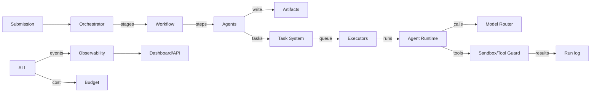

# 47 — DATA FLOW

---

## 1. Primary Data Flows

### 1.1 Idea → Intake record
```
Human API POST /projects {idea_text}
→ orchestrator: normalize, clarity check
→ requirements agent: clarifying loop (max 3)
→ intake.md artifact + project_state.intake fields
```

### 1.2 Research artifacts
```
workflow_research step
→ fan_out market/competitor/tech (agents)
→ each writes <dept>_report.md artifact (final)
→ join → validate_outcome gate
```

### 1.3 PRD → roadmap → tasks
```
PRD.md +(approval P5)
→ architecture (+P6)
→ roadmap.md
→ task planner decomposes → task rows (DAG)
→ dispatcher queues
```

### 1.4 Code lifecycle (task → review → merge)
```
dev task RUNNING
→ dev agent: read files → write code → run tests → git commit
→ artifacts: diff(patch), test_report
→ task REVIEW
→ reviewer → verdict
→ APPROVED → merge → snapshot
```

### 1.5 Test result → fix loop
```
test run (unit) FAILED
→ event test.run_failed
→ bug triage → fix subtask
→ dev agent (context: failure detail)
→ re-run focused tests → full → merge
```

### 1.6 Model call flow (cost + trace)
```
agent run → router(model, profile)
→ model_call_log row (tokens/cost/latency)
→ trace spans appended
→ budget accumulator update → thresholds
```

---

## 2. State Ownership Matrix

| Data | Written by | Read by |
|---|---|---|
| project.stage | orchestrator | all |
| project.decisions | orchestrator/decision | agents (scoped) |
| task rows | planner/dispatcher/agents | agents (their tasks) |
| agent_run | runtime | observability/task |
| artifact meta | artifact system | all |
| memory rows | runtime/memory | runtime |
| event log | all | observability |
| approval | approval | human, orchestrator |
| deploy_record | deployment | devops, observability |

---

## 3. Data Flow Principles

1. **Write once to source of truth**; derived views (dashboards, summaries) are recomputed.
2. **No cross-module direct DB writes** (see `28` §6 ownership boundaries).
3. **Every crossing logged** with trace_id.
4. Artifacts referenced by pointer (id+version), not embedded copies.

---

## 4. Mermaid: Macro Data Flow

