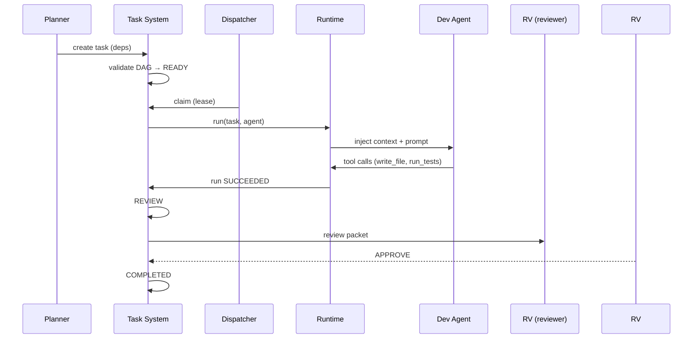
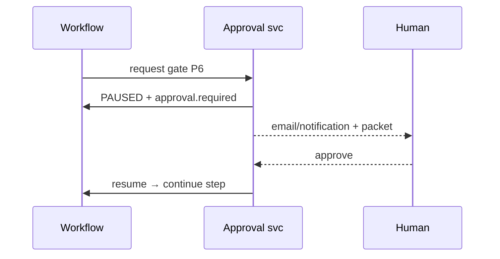
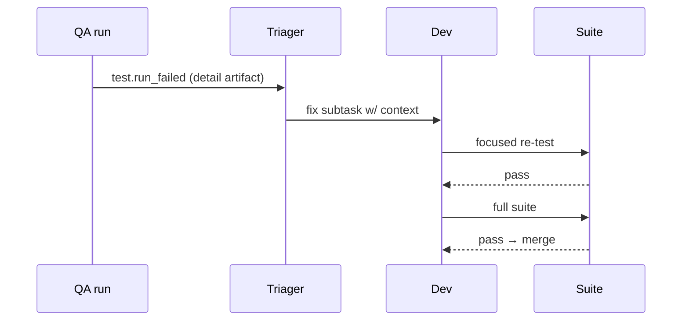

# 48 — SEQUENCE FLOWS

---

## 1. End-to-End Simulated Sequence: "Build a SaaS web application for X."

Hypothetical concrete project: **"Reviewly" — a SaaS that lets small e-commerce stores
collect, manage, and reply to product reviews from one dashboard.** Low-med complexity,
CRUD + auth + a public embed widget + a webhook. Illustrates the whole org.

### Step 1 — Idea → Intake
```
Human: POST /projects {idea: "SaaS for e-commerce review management ..."}
Orchestrator: create project; stage=IDEA→INTAKE
Requirements Agent: clarity check → 2 clarifying questions (target market,
  integration platforms) → human answers → intake.md v1 final
```

### Step 2 — Research
```
flow: fan_out market/market+competitor/tech
Market Agent: web_search "review management SaaS market size" → market_report.md
  (TAM estimate $X, segments: e-commerce SMB) with cites
Competitor Agent: "review management platforms comparison" → competitor_report.md
  (feature table: Yotpo, Judge.me, Reviews.io; gaps: no AI-reply, no unified inbox)
Technical Agent: "review widget best practices, e-commerce APIs (Shopify), AI reply
  feasibility" → tech_research.md
Join all → feasibility gate
```

### Step 3 — Validation
```
Decision Agent: confidence 0.75; feasibility: technical yes, cost ~$X/mo runway
  for MVP scale; risk: API rate limits of stores; recommendation GO (P4 gate → human)
```

### Step 4 — PRD
```
PM: personas (store owner, CX manager), journeys (connect store, collect reviews,
  moderate, auto-reply, embed widget), MoSCoW:
  Must: store connect (W/OAuth), review ingest, moderation queue, reply, public widget
  Should: AI reply suggestions (ph1), webhook notify
  Could: sentiment analytics
  Won't: multi-brand, enterprise SSO
PRD.md v1 → P5 approval → approved
```

### Step 5 — Architecture
```
System Architect: C4 — frontend (React+TS), API (FastAPI), DB (Postgres), worker
  (ingest queue), embed widget (small web component), storage, openai client for AI
Database Architect: tables stores, reviews, replies, webhooks, settings + pgvector
  for AI? (ph1 optional)
Security Architect: auth (OAuth login to stores), API tokens for widget, role scope
  per store, secrets in vault, threat notes
DevOps Architect: docker-compose local; staging later; CI building images;
  migrations via alembic
tech_selection.md + ADRs → P6 approval → approved
```

### Step 6 — Roadmap
```
PM: milestones M1 scaffold+DB, M2 store connect+ingest, M3 moderation+reply,
  M4 widget, M5 AI replies, M6 hardening/deploy
task planner: epics → tasks (each with deps, write-scope, estimates)
Example tasks (subset):
  t4  BACKEND auth/tenants
  t7  BACKEND review ingest API
  t12 FRONTEND store-connect page
  t15 FRONTEND moderation queue
  t20 INTEGR shopify webhook listener
  t25 QA e2e connect&ingest flow
```

### Step 7 — Development
```
Dispatcher: assigns t4,t7 to dev_backend (scope app/services), t12,t15 dev_frontend
  (scope web/), parallel via write-scope
dev_backend: writes models, endpoints, tests → commit → task REVIEW
Reviewer: APPROVE (after 1 change request) → merge
...
t20 INTEGR: test against webhook payload fixture (sandbox localhost) 
```

### Step 8 — QA
```
QA lead: coverage matrix against acceptance criteria; test layers run in order
per merge; one integration failure in "shopify HMAC validation" → bug triage →
fix subtask → dev fixes → re-run → pass
qa_report.md → P7 → approved
```

### Step 9 — Security
```
Security agent: bandit/semgrep scan → 1 HIGH "AIOOpenAI api key logged in dev",
  fix → re-scan clean; dep audit: flask pinned vuln fixed; dashboard secret scan
security_report.md → P8 → approved (no critical)
```

### Step 10 — Deployment
```
Deployment agent: Dockerfile gen, compose up local, migration run,
  health check OK; P9 human approval → deploy_record final
```

### Step 11 — Monitoring
```
Monitoring agent: adds /health probing, logs error-rate metric collection config,
  alert rule "5xx>1% 5min → incident"
baseline established
```

### Step 12 — Maintenance & Improvement
```
7 days later: incident "webhook 500 after Shopify schema change" → triage →
 fix → redeploy; retrospective lesson "pin webhook JSON schema parsing with fixture
 tests" → org memory → playbook update (reviewed)
```

---

## 2. Key Sequence Diagrams

### 2.1 Task assignment & execution



### 2.2 Approval gate



### 2.3 Fix loop

